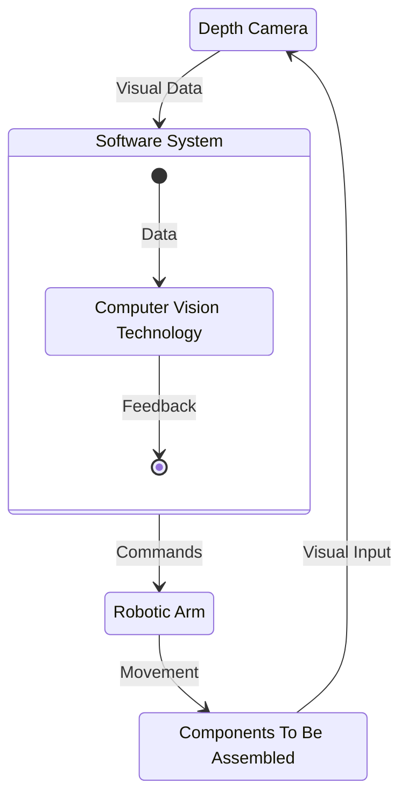
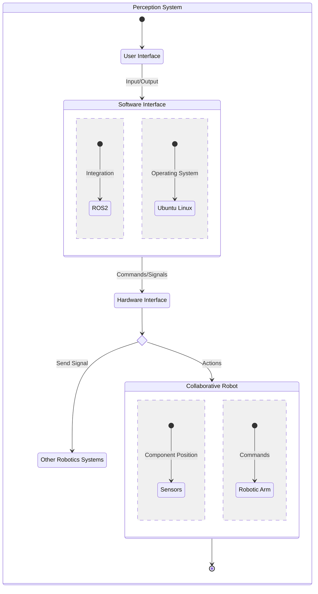
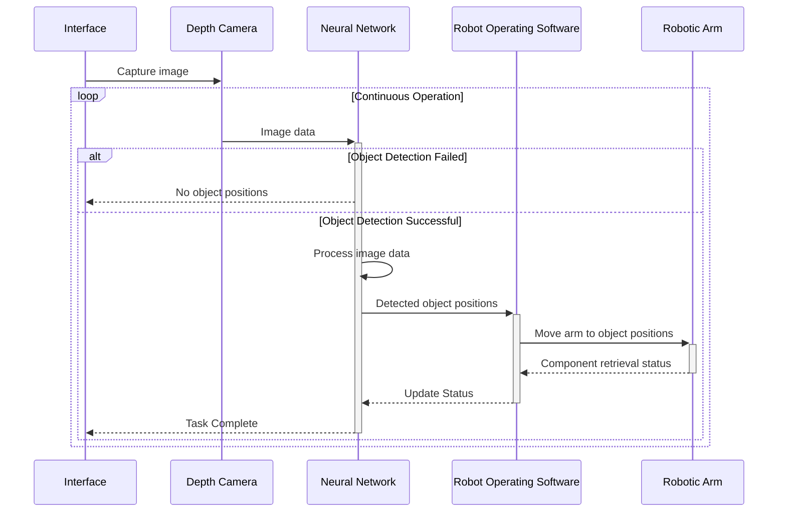

<link rel="stylesheet" href="../styles/styles.css" type="text/css">

> *[This template can be adapted as necessary (i.e., with good reason) to suit the project specifics.]*

<!-- TOC ignore:true -->
# Robot Vision System For A Pick And Place Task
<!--
	Co-Author: @dau501
	Editor(s):
	Year: 2023
-->

`Detailed System Design and Implementation Report`

<!-- TOC ignore:true -->
## Industry Project 24
List of your Names:

|Name|Position|Email|
|:-|:-|:-|
|@Slothman1|Team Leader/Client Liaison|id@swin.student.edu.au|
|@dau501|Development Manager/Planning Manager|id@swin.student.edu.au|
|@finnmcgearey|Support Manager/Developer|id@swin.student.edu.au|
|@vkach|Quality Manager/Developer|id@swin.student.edu.au|
|@NickMcK14|Support Manager/Developer|id@swin.student.edu.au|
|@Huy-GV|Quality Manager/Developer|id@swin.student.edu.au|

<!-- SUBJECT CODE, NAME, SEMESTER AND DATE -->

```gherkin
@Note:
Please read carefully.
Throughout this document, all text in RED ITALICS should be replaced with data relevant to your project.
Delete all the explanatory text in RED, including this box before submission.
```

<div class="page"/><!-- page break -->

# DOCUMENT SIGN OFF
|Name|Position|Signature|Date|
|:-|:-|:-|:-|
|@Slothman1|Team Leader/Client Liaison|student_signature(&emsp;)|DD/MM/2023|
|@dau501|Development Manager/Planning Manager|student_signature(&emsp;)|DD/MM/2023|
|@finnmcgearey|Support Manager/Developer|student_signature(&emsp;)|DD/MM/2023|
|@vkach|Quality Manager/Developer|student_signature(&emsp;)|DD/MM/2023|
|@NickMcK14|Support Manager/Developer|student_signature(&emsp;)|DD/MM/2023|
|@Huy-GV|Quality Manager/Developer|student_signature(&emsp;)|DD/MM/2023|

> *[When document is finalised for submission, all team members must affix their signature in the Document Sign Off table]*\
> ***[No-one should sign unless they have read the report and agree with it.]***

# CLIENT SIGN OFF
|Name|Position|Signature|Date|
|:-|:-|:-|:-|
|@FelipMarti|Research Fellow|<br/>|&emsp;/&emsp;/2023|

|Organisation|
|:-|
|Swinburne's Factory of the Future<br/><br/><br/><br/>|

> *[Client to sign off on the Software Design to signify they agree with the design]*

<div class="page"/><!-- page break -->

<div class="page"/><!-- page break -->

# Introduction
Project 24, aims to enhance a collaborative robot (cobot) by developing and implementing a perception system for pick-and-place tasks in the Factory of the Future (FOF).
Currently, the cobot operates on predefined positions, limiting its capabilities.
The goal is to enable the cobot to autonomously identify and locate electronic components using computer vision and artificial intelligence.

Utilising state-of-the-art technologies in computer vision, sensors, robotics, and artificial intelligence,
the project will develop a real-time object detection, processing, and analysis system.
This system will continuously learn and adapt to its environment, enhancing the cobot's capabilities.

This document serves as a comprehensive design of the project and overall implementation planned.
It aims to provide sufficient information for clients and project leads, ensuring easy understanding of the system's design and implementation of Project 24.

## Overview
This document records the technical details, considerations and design strategies employed to build the system.
It aims to provide guidance and serve as a valuable reference for developers involved in the implementation,
while also offering insightful information to relevant stakeholders.
It also covers deeper details of the system architecture described in the SADRR by providing a comprehensive UML class diagram,
which encapsulates the hierarchical relationships and interdependencies between various classes and components.
The document also discusses the verifications for said design and systematically examines how established requirements and common use cases are achieved.

## Definitions, Acronyms and Abbreviations
> *[Provide the definition of all terms, acronyms, and abbreviations used in this document.]*

## Assumptions and Simplifications
When developing the system design for this project,
the following assumptions were made to further narrow down the scope of the project and ensure that it was feasible:
* The system will not have to account for parts that are not in their assigned locations.\
However, the system will have to halt when an object is detected and found to obstruct the cobot in completing its task.
* The fine motor controls for the cobot is already completed and accurate.\
As such, no development will need to be made to derive and implement transfer functions.
* The tools and software used in the project (i.e., Depth Camera, cobot, and ROS2) are not subject to change.
* The types of objects the cobot will interact with are not subject to change.
* The locations of where the cobot will have to pick up objects is not subject to change.
* The locations of where the cobot will have to place objects is not subject to change.
* Objects that are almost identical, such as the PCB parts, will have labels to distinguish between different types,
such as the PCB for a barometer vs. a thermometer.

To ensure that the system that is being developed is feasible and able to be completed in the allotted time,
some aspects of the problem space have been designed to simplify the developmental process.

These aspects are as follows:
* The locations of parts that that the cobot will have to pick and place are predetermined.\
Therefore, the Depth Camera does not need to 'search' for parts, rather just check if a part is in a predetermined location.
* The cobot will only be allowed to perform a pick and place task if a part is in one of the predetermined locations.
* The individual parts that the cobot will have to pick and place will be color coded,
ensuring that the Depth Camera will be able to effectively differentiate between the required parts and the surrounding environment.

<div class="page"/><!-- page break -->

# System Architecture Overview


Multiple pieces of software are required for the cobot to successfully complete the pick and place task.
These components consist of the perception system to perceive the environment and provide visual data, and
the software system that utilises computer vision and machine learning to detect the objects.
Once the cobot has performed a movement, the environment will have changed,
which provides new visual data to be passed into the perception system to continue the cycle.

The flow of data is shown to pass through multiple interfaces, from the user interface to the software interface to the hardware interface.
ROS2 is utilised to allow for the visual data to be passed into ROS2 interfaces which allows for the data to be easily used within ROS2 programs and
therefore to perform actions.


# Detailed System Design
The system design will follow the diagram shown below, which displays a modular design to allow for effective development and implementation.
ROS2 graph components including nodes, topics, actions, and bags will be used to maintain modularity and a clear data flow.

Visual data from the depth camera will pass to image topics which will then be aggregated in the `Visual Data Aggregator` node.
After passing through the `Container Detector` node, the data is then placed in the `Visual Data Logger` bag which will be used to perform testing and for debugging.

The image processing system then validates the input data and places the data in the `Perception Data Logger` and
passes the data into the `Computer Vision Network` node which will perform the object detection.
This will return the object position which can then be used by the motion controller to perform movement actions, thus completing the pick and place task.


## The Detailed Design and Justification
> *[For example, if using OO design, the design should include one or more class diagrams and possibly other UML diagrams,*
> *the necessary description and justifications of them (including design patterns and heuristics used if any).*
>
> *An alternative approach can also be adopted, In any case, the design decisions need to be justified.]*

## Design Verification
The following sequence diagram offers a visual representation of how the proposed system complies with the project requirements.
It shows the interactions between components and the continuous flow of operations.
It depicts the real-time object detection and communication of object positions which enables autonomous operation and ongoing learning and adaptation.


### Real-time Object Detection, Processing, and Analysis
The depth camera continuously captures images, and the neural network processes the image data in real-time.
The object positions detected by the neural network are sent to the robot operating software promptly.
This verifies that the system enables real-time object detection, processing, and analysis, ensuring accuracy and speed.

### Object Location Data Communication
The object positions detected by the neural network are communicated from the depth camera to the robot operating software.
The robot operating software then uses this data to control the robotic arm's movements.
This verifies that the system successfully communicates the object location data to the robot operating software, facilitating the pick and place task.

### Continuous Learning and Adaptation
It is not explicitly depicted in the sequence diagram but,
the neural network module is designed to continuously learn and adapt to new configurations of the chips in their stands once implemented.
Through training and updating the neural network with new data, it can improve its object recognition and location detection capabilities over time.
This verifies that the system has the potential to continuously learn and adapt to different chip layouts, without the need for user input.

### Autonomous Systems
The sequence diagram shows the continuous operation of the system without the need for human intervention.
The robotic arm moves to the detected object positions automatically based on the commands from the robot operating software.
The system operates independently, minimising human involvement and fulfilling the requirement of an autonomous system.

<div class="page"/><!-- page break -->

# Implementation
> *[In this part of the report, provide an overview of the state of the system implementation (relative to the SRS, architecture design and detailed design), and*
> *document the key implementation decisions.]*

# References
> *[If you have used information from published sources, show where it came from here (and cite them in the relevant places of this report).*\
> *Use the Harvard system of citation (or another system, but be consistent).*\
> *For instance, they may be books, journal articles, or websites.]*

> ***[Your reference list entry must be in the form of***\
> &emsp; **Author, Initial(s) Year, *Title of Document/Webpage/Website*, Organisation/Host, viewed Day Month Year, &lt;URL>.**
>
> &emsp; example
>
> &emsp; Yates, J 2009, Tax expenditures and housing, Australian Housing and Urban Research Institute, viewed 12 November 2013,\
> &emsp; <http://www.ahuri.edu.au/publications/download/ahuri_judith_yates_research_paper>.]
>
> ***[Your in-text may be in the form of***
> * **Direct quote**\
> "Most official estimates ..." (Yates 2009).
> * **Paraphrase**\
> Yates (2009) looked at the equity implications of tax ...]
>
> ***[For more information on the Harvard style guide, refer to***\
> &emsp; <http://www.swinburne.edu.au/lib/studyhelp/harvard_style.html>]
