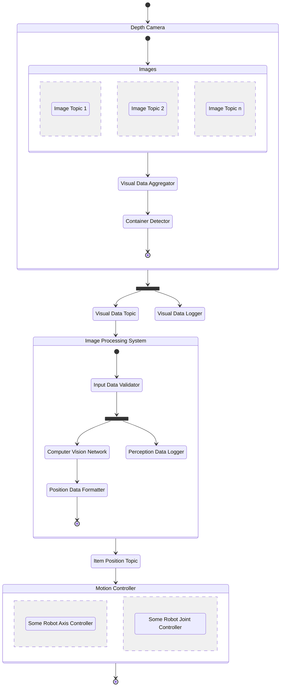

<link rel="stylesheet" href="../styles/styles.css" type="text/css">

> *[This template can be adapted as necessary (i.e., with good reason) to suit the project specifics.]*

<!-- TOC ignore:true -->
# Robot Vision System For A Pick And Place Task
<!--
	Co-Author: @dau501
	Editor(s):
	Year: 2023
-->

`Detailed System Design and Implementation Report`

<!-- TOC ignore:true -->
## Industry Project 24
List of your Names:

|Name|Position|Email|
|:-|:-|:-|
|@Slothman1|Team Leader/Client Liaison|id@swin.student.edu.au|
|@dau501|Development Manager/Planning Manager|id@swin.student.edu.au|
|@finnmcgearey|Support Manager/Developer|id@swin.student.edu.au|
|@vkach|Quality Manager/Developer|id@swin.student.edu.au|
|@NickMcK14|Support Manager/Developer|id@swin.student.edu.au|
|@Huy-GV|Quality Manager/Developer|id@swin.student.edu.au|

<!-- SUBJECT CODE, NAME, SEMESTER AND DATE -->

```gherkin
@Note:
Please read carefully.
Throughout this document, all text in RED ITALICS should be replaced with data relevant to your project.
Delete all the explanatory text in RED, including this box before submission.
```

<div class="page"/><!-- page break -->

# DOCUMENT SIGN OFF
|Name|Position|Signature|Date|
|:-|:-|:-|:-|
|@Slothman1|Team Leader/Client Liaison|student_signature(&emsp;)|DD/MM/2023|
|@dau501|Development Manager/Planning Manager|student_signature(&emsp;)|DD/MM/2023|
|@finnmcgearey|Support Manager/Developer|student_signature(&emsp;)|DD/MM/2023|
|@vkach|Quality Manager/Developer|student_signature(&emsp;)|DD/MM/2023|
|@NickMcK14|Support Manager/Developer|student_signature(&emsp;)|DD/MM/2023|
|@Huy-GV|Quality Manager/Developer|student_signature(&emsp;)|DD/MM/2023|

> *[When document is finalised for submission, all team members must affix their signature in the Document Sign Off table]*\
> ***[No-one should sign unless they have read the report and agree with it.]***

# CLIENT SIGN OFF
|Name|Position|Signature|Date|
|:-|:-|:-|:-|
|@FelipMarti|Research Fellow|<br/>|&emsp;/&emsp;/2023|

|Organisation|
|:-|
|Swinburne's Factory of the Future<br/><br/><br/><br/>|

> *[Client to sign off on the Software Design to signify they agree with the design]*

<div class="page"/><!-- page break -->

<div class="page"/><!-- page break -->

# Introduction
> *[In this opening, briefly*
> * *Discuss the **software/system** that will be developed;*
> * *Define the purpose of this **Detailed Design and Implementation Report** and identify its target reader or audience.]*

## Overview
> *[Provide an overview (or executive summary) of this document]*

## Definitions, Acronyms and Abbreviations
> *[Provide the definition of all terms, acronyms, and abbreviations used in this document.]*

## Assumptions and Simplifications
> *[List and discuss the assumptions and simplifications you have made in developing the detailed system design (as presented in this document).]*

<div class="page"/><!-- page break -->

# System Architecture Overview
> *[Provide a high-level overview of the system architecture as defined in the System Architecture Design and Research Report.*\
> *This is to provide a context for the discussions in the remainder of this document.]*

# Detailed System Design
The system design will follow the diagram shown below, which displays a modular design to allow for effective development and implementation.
ROS2 graph components including nodes, topics, actions, and bags will be used to maintain modularity and a clear data flow.

Visual data from the depth camera will pass to image topics which will then be aggregated in the `Visual Data Aggregator` node.
After passing through the `Container Detector` node, the data is then placed in the `Visual Data Logger` bag which will be used to perform testing and for debugging.

The image processing system then validates the input data and places the data in the `Perception Data Logger` and
passes the data into the `Computer Vision Network` node which will perform the object detection.
This will return the object position which can then be used by the motion controller to perform movement actions, thus completing the pick and place task.



## The Detailed Design and Justification
> *[For example, if using OO design, the design should include one or more class diagrams and possibly other UML diagrams,*
> *the necessary description and justifications of them (including design patterns and heuristics used if any).*
>
> *An alternative approach can also be adopted, In any case, the design decisions need to be justified.]*

## Design Verification
> *[Present and discuss the verification of your design in this section.*\
> *A usual approach for design verification is to demonstrate that the use scenarios (from the SRS) can be supported by your design.*\
> *Well accepted alternative approaches can also be used instead.]*

<div class="page"/><!-- page break -->

# Implementation
> *[In this part of the report, provide an overview of the state of the system implementation (relative to the SRS, architecture design and detailed design), and*
> *document the key implementation decisions.]*

# References
> *[If you have used information from published sources, show where it came from here (and cite them in the relevant places of this report).*\
> *Use the Harvard system of citation (or another system, but be consistent).*\
> *For instance, they may be books, journal articles, or websites.]*

> ***[Your reference list entry must be in the form of***\
> &emsp; **Author, Initial(s) Year, *Title of Document/Webpage/Website*, Organisation/Host, viewed Day Month Year, &lt;URL>.**
>
> &emsp; example
>
> &emsp; Yates, J 2009, Tax expenditures and housing, Australian Housing and Urban Research Institute, viewed 12 November 2013,\
> &emsp; <http://www.ahuri.edu.au/publications/download/ahuri_judith_yates_research_paper>.]
>
> ***[Your in-text may be in the form of***
> * **Direct quote**\
> "Most official estimates ..." (Yates 2009).
> * **Paraphrase**\
> Yates (2009) looked at the equity implications of tax ...]
>
> ***[For more information on the Harvard style guide, refer to***\
> &emsp; <http://www.swinburne.edu.au/lib/studyhelp/harvard_style.html>]
