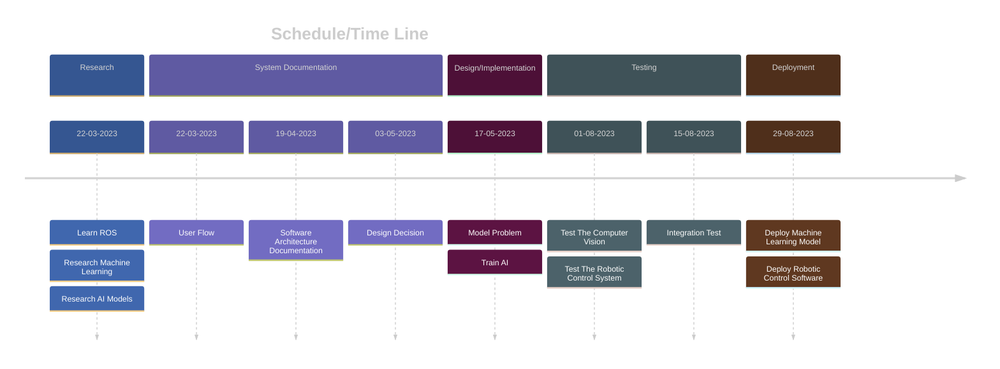

<link rel="stylesheet" href="../styles/styles.css" type="text/css">

<!-- TOC ignore:true -->
# Robot Vision System For A Pick And Place Task
<!--
	Co-Author: @dau501
	Editor(s): @Slothman1, @Huy-GV, @finnmcgearey, @vkach, @NickMcK14
	Year: 2023
-->

`Project Plan`

<!-- TOC ignore:true -->
## Industry Project 24
List of your Names:

|Name|Position|Email|
|:-|:-|:-|
|@Slothman1|Team Leader/Client Liaison|id@swin.student.edu.au|
|@dau501|Development Manager/Planning Manager|id@swin.student.edu.au|
|@finnmcgearey|Support Manager/Developer|id@swin.student.edu.au|
|@vkach|Quality Manager/Developer|id@swin.student.edu.au|
|@NickMcK14|Support Manager/Developer|id@swin.student.edu.au|
|@Huy-GV|Quality Manager/Developer|id@swin.student.edu.au|

<!-- SUBJECT CODE, NAME, SEMESTER AND DATE -->

```gherkin
@Note:
Please read carefully.
Throughout this document, all text in RED ITALICS should be replaced with data relevant to your project.
Delete all the explanatory text in RED, including this box before submission.
```

<div class="page"/><!-- page break -->

# DOCUMENT SIGN OFF
|Name|Position|Signature|Date|
|:-|:-|:-|:-|
|@Slothman1|Team Leader/Client Liaison|student_signature(&emsp;)|DD/MM/2023|
|@dau501|Development Manager/Planning Manager|student_signature(&emsp;)|DD/MM/2023|
|@finnmcgearey|Support Manager/Developer|student_signature(&emsp;)|DD/MM/2023|
|@vkach|Quality Manager/Developer|student_signature(&emsp;)|DD/MM/2023|
|@NickMcK14|Support Manager/Developer|student_signature(&emsp;)|DD/MM/2023|
|@Huy-GV|Quality Manager/Developer|student_signature(&emsp;)|DD/MM/2023|

> *[When document is finalised for submission, all team members must affix their signature in the Document Sign Off table]*\
> ***[No-one should sign unless they have read the report and agree with it.]***

# CLIENT SIGN OFF
|Name|Position|Signature|Date|
|:-|:-|:-|:-|
|@FelipMarti|Research Fellow|<br/>|&emsp;/&emsp;/2023|

|Organisation|
|:-|
|Swinburne's Factory of the Future<br/><br/><br/><br/>|

> *[Client to sign off on the Project Plan to signify they agree with the plan]*

<div class="page"/><!-- page break -->

# CONTENTS
<!-- TOC -->

* [DOCUMENT SIGN OFF](#document-sign-off)
* [CLIENT SIGN OFF](#client-sign-off)
* [CONTENTS](#contents)
* [INTRODUCTION](#introduction)
	* [BACKGROUND](#background)
	* [KEY PROJECT PERSONNEL](#key-project-personnel)
		* [CLIENT](#client)
		* [OTHER STAKE HOLDERS](#other-stake-holders)
		* [PROJECT SUPERVISOR, TEAM LEADER AND KEY PROJECT MEMBERS](#project-supervisor-team-leader-and-key-project-members)
* [TERMS OF REFERENCE](#terms-of-reference)
	* [OBJECTIVES](#objectives)
	* [Scope](#scope)
	* [CRITICAL SUCCESS FACTORS](#critical-success-factors)
	* [ACCEPTANCE CRITERIA](#acceptance-criteria)
* [ESTABLISHMENT](#establishment)
	* [PROCESSES, PROCEDURES AND STANDARDS](#processes-procedures-and-standards)
	* [PROJECT ENVIRONMENT](#project-environment)
	* [PROJECT TEAM SKILL DEVELOPMENT REQUIREMENTS](#project-team-skill-development-requirements)
* [DELIVERABLES, ACTIVITIES AND CAPITAL RESOURCES](#deliverables-activities-and-capital-resources)
	* [DELIVERABLES](#deliverables)
		* [Software systems](#software-systems)
		* [Documentation](#documentation)
		* [Hardware modifications](#hardware-modifications)
	* [ACTIVITIES](#activities)
		* [Research:](#research)
		* [Design and implementation:](#design-and-implementation)
		* [Deployment:](#deployment)
		* [Testing:](#testing)
		* [System Documentation:](#system-documentation)
	* [RESOURCES](#resources)
		* [Hardware Resources:](#hardware-resources)
		* [Software resources:](#software-resources)
		* [Human resources:](#human-resources)
		* [Budget:](#budget)
* [ORGANISATION AND STRUCTURE](#organisation-and-structure)
* [RISKS](#risks)
* [SCHEDULE](#schedule)
	* [PROJECT TIME LINE](#project-time-line)
	* [EXTERNAL DEPENDENCIES](#external-dependencies)
	* [ASSUMPTIONS](#assumptions)
* [BUDGET](#budget)
* [REFERENCES](#references)
* [TABLES INDEX](#tables-index)

<!-- /TOC -->

<div class="page"/><!-- page break -->

# INTRODUCTION
This document is designed to serve as a guide to use in relation to the proposed plans and ideas for the project.
This document is deigned to be easily accessible to the client to see the intentions with the project.
This document will assist in defining future documents as this outlines expectations, proposed ideas and a rough plan for the project.

## BACKGROUND
The Factory of the Future focuses on developing technologies,
the latest being a Cobot that assists an operator assemble devices, which is in need of a vision system.
Currently, the required pick and place tasks are only performed under rigidly pre-programmed conditions due to the lack of a perception system.
The Factory of the Future wants this project to be completed to both show how emerging technologies can be used to automate tasks,
as well as, how robots can be incorporated into regular workflows.

## KEY PROJECT PERSONNEL
The key personnel involve in this project are as follows:

### CLIENT
@FelipMarti is a research fellow within the Factory of the Future.
With a background in IoT he is now working with intelligent robots and computer vision systems.

### OTHER STAKE HOLDERS
S.W: Senior Technical Officer at the Factory of the Future, responsible for designing,
developing and maintaining equipment for safe use and for demonstrations at the Factory of the Future.\
Swinburne clients: potential investors or researchers interested in the technology and wish to view it in progress.\
Swinburne developers: People responsible for the maintaining of the system.\
Prem P.J: The Director of the Factory of the Future.
Prof. J is responsible for leading and overseeing the projects within the Factory of the Future.

### PROJECT SUPERVISOR, TEAM LEADER AND KEY PROJECT MEMBERS
@Danaclocs: Project Supervisor\
@Slothman1: Team Leader and Client Liaison\
@dau501: Development Manager and Planning Manager\
@finnmcgearey: Support Manager and Developer\
@vkach: Quality Manager and Developer\
@NickMcK14: Support Manager and Developer\
@Huy-GV: Quality Manager and Developer

<div class="page"/><!-- page break -->

# TERMS OF REFERENCE
The goal of this project is to be able to provide a vision system to a Cobot,
while using machine learning techniques to allow the robot to assess the situation and act accordingly.
Currently the position of the objects are predefined, if an object doesn't exist there then the robot cannot perform the pick and place task.

## OBJECTIVES
The objectives of this project are to design and implement a vision system for a pick and place task using a robot located within the Factory of the Future.
To achieve this, the following must be achieved:
* Develop a vision system that will enable the robot to locate objects to pick and place, even if they are not in the predefined position.
* The vision system should be able to detect objects accurately and efficiently, and provide the necessary information to the robot's control system.
* The vision system should also be able to detect if objects are missing/out of place and pause until given a command that it is safe to continue.
* The vision system will provide the robot with ample information to perform and subsequently execute its task.

## Scope
The scope of this project includes the development of a vision system that is compatible with the robot's hardware and software.

The following list outlines the capabilities that are in scope of the project, in addition to existing pick-and-place operations of the cobot.
* Detection of components under varying lighting conditions and at different distances that are within reach of the cobot.
* Detection of partially occluded components.
* Detection of absent components and ability to shift to an alternative position.

The following capabilities, including those that may emerge in later stages of the project, are considered to be out of scope.
* Detection of transparent components.
* Detection or manipulation of fallen or mal-oriented components (such components are considered to be absent).
* Detection or manipulation of components that differ from originally established shapes.

<div class="page"/><!-- page break -->

## CRITICAL SUCCESS FACTORS
The critical success factors for this project include:
* Developing a vision system that is accurate, efficient, and reliable.
* Ensuring that the vision system:
	* is compatible with the robot's hardware and software.
	* can detect objects in a variety of lighting conditions and at various distances from the robot.
	* can detect objects that are partially occluded or have complex shapes.
* Developing necessary code so that the robot can perform the required task from vision system inputs.

## ACCEPTANCE CRITERIA
The acceptance criteria for this project include:
* Successful implementation and testing of the vision system.
* The vision system should be integrated with the robot's control system and enable the robot to perform pick and place tasks with increased efficiency and accuracy.
* The system should be able to detect:
	* objects accurately and efficiently.
	* objects in a variety of lighting conditions and at various distances from the robot.
	* objects that are partially occluded or have complex shapes.
	* if objects are out of place or missing and halt the task until told to continue.
* The robot should move and perform its programmed task.

<div class="page"/><!-- page break -->

# ESTABLISHMENT
## PROCESSES, PROCEDURES AND STANDARDS
The project team will follow the Kanban methodology for this project as it is a system that easily allows us to monitor our current tasks and
allows for a more independent work style, thus increasing overall productivity.

The Kanban board will have 8 columns: **New**, **Reopened**, **Requested**, **Fix**, **Deploy**, **Merged**, **Closed**, and **Dropped**,
which will be automated by GitHub's (classic) Projects automation features.
The board will serve as the primary source of information for the team's progress,
with each task being represented by a card that will move across the board's columns as it progresses through the project's workflow.

The team will utilize GitHub as the source control system for this project.
All code changes will be submitted via pull requests, and
a team member other than the author will be responsible for reviewing the changes before they are merged into the **main** branch.

All code produced must follow good programming practice, in particular code must follow consistent conventions of naming variables, functions, classes, etc.
(for example camelCase or snake_case).
Clear, concise comments will also be included to help with readability and comprehensibility.

## PROJECT ENVIRONMENT
The project will require the use of various programming languages, frameworks, modules, and development environments to be successfully completed.
The following tools and technologies will be utilised throughout the project:
* C/C++
* Python
* OpenCV
* PyTorch
* Robot Operating System (ROS2)
* Markdown and CSS
* Ubuntu OS
* Potential IDEs/ text editors:
	* Visual Studio
	* Visual Studio Code
	* VIM
	* PyCharm

<div class="page"/><!-- page break -->

## PROJECT TEAM SKILL DEVELOPMENT REQUIREMENTS
The project will require knowledge in multiple fields of study to successful deliver the final product;
the team will be required to have expertise in the following areas:
* Computer Vision
* Sensors (ZED camera)
* Robotics
	* Completed the tutorials for ROS
* AI
* Software Programming
	* Python (Particularly OpenCV & PyTorch)
	* C/C++

The team members will be encouraged to attend relevant training sessions and conferences to develop their skills in these areas.
Online tutorials will be helpful references and sources for honing programming capabilities.

<div class="page"/><!-- page break -->

# DELIVERABLES, ACTIVITIES AND CAPITAL RESOURCES
## DELIVERABLES
### Software systems
* Functioning computer vision system satisfying all requirements within scope.
* Functioning robotic control system satisfying all requirements within scope.

### Documentation
* Documents outlining design choices as specified in [System Documentation](#system-documentation).
* Documents detailing test plans as specified in [Testing](#testing).
	* Include simulation test plans and results.
	* Include integration tests and results.

### Hardware modifications
* Tool that mounts the depth camera such that all items of interest are within clear view.

## ACTIVITIES
### Research:
* Learn to use Robot Operating System (ROS) within Ubuntu.
* Study concepts of machine learning, with a focus on computer vision.
* Research ways to build an AI model based on project needs.

### Design and implementation:
* Model the problem into the software system.
* Train the machine learning model in simulation.

### Deployment:
* Deploy the machine learning model in production.
* Deploy the robotic control software into the robot arm.

### Testing:
* Test the computer vision system in simulation using a collection of photographs taken in various conditions.
* Test the robotic control system in simulation, covering all identified edge cases.
* Integration test on the robot arm with the control and computer system installed, covering all edge cases as identified in prior simulation tests.

### System Documentation:
* User flow documentation: robot behaviors given an input, including explanation for special cases.
* Software architecture documentation: software models, their relationship and interactions.
* Design decision documentation: explanation for software tool/framework and various design choices.
* Installation manual.
* Instruction manual.
* Standard of Practice (SoP).

<div class="page"/><!-- page break -->

## RESOURCES
### Hardware Resources:
This includes the necessary hardware components for the implementation of the vision system:
* ZED 2 Depth Camera and its mounting tool.
* UR5e robot arm.
* Control tablet for the cobot.
* The assembly line delivering items to the cobot.

The cobot and assembly line are already situated in the FOF.\
The Depth Camera and its mounting tool will be provided by the client, with the team proposing designs for the mounting tool.

### Software resources:
This includes software tools and libraries required for vision system development and integration, such as OpenCV and PyTorch.

### Human resources:
This project will require a team of skilled professionals, including software engineers, computer vision experts, and robotics specialists.

### Budget:
A budget will need to be allocated for hardware and software resources, as well as any other project-related expenses.

<div class="page"/><!-- page break -->

# ORGANISATION AND STRUCTURE
> *[List all the groups of people that will be involve or has a role in the project,*
> *Be sure to include every role (especially business users who will be interviewed during the requirements modelling and those involved in acceptance testing)]*
>
> *[This is not just your team.*\
> *It is anyone else who has direct interaction with the project.*\
> *This also includes people will be interacting with the software;*\
> *(e.g., people who test it or are interviewed about it, and other members of their organisation)]*
>
> *[Describe the organisational structure that will be used during the project.*\
> *For example, a matrix structure may be used in describing role of each group.*\
> *This enables the person responsible for the activity or deliverable to see the groups of people to me managed]*

#### Activities and Deliverables
<!-- This table is confusing and likely subject to change. -->
|Activities and Deliverables|Group involved as identified above|
|:-|:-|
|**From 4.2**||
|**From 4.1**||

**Table 1 Activities and Deliverables**

<div class="page"/><!-- page break -->

# RISKS
Risks are a major problem in projects, they can slow things to a grinding halt if not properly dealt with and mitigated.

##### Risk 1:
**Difficulty in hardware and software integration.**\
With the project utilising cameras and ROS the integration of hardware and software can lead to issues down the line.\
Regular testing of the software in Ubuntu OS as well as frequent integration with the hardware will avoid major issues.

##### Risk 2:
**Lack of expertise in computer vision and robotics.**\
As mentioned in the first risk this project is integrated with a robotics system.\
With many people not working directly with robots, a lack of experience is common.
However risks are easily mitigated with training and research into the system.

##### Risk 3:
**Inability to meet project deadlines.**\
In the duration of a project things will affect the deadlines; be that team members falling ill,
supervisors requesting work sooner, or even clients needing code faster.\
A general mitigation strategy is to be organised, utilising project boards can help, also regular meetings to be aware of issues.
Overall this is a hard to mitigate risk as problems can arise quickly.

##### Risk 4:
**Changes in project requirements or objectives.**\
As mentioned above, changes in objectives can change the deadline timing, making it harder to achieve in most cases.
However the larger issue is a change in objectives can change the budget, often demanding a time crunch or stretched resources.\
To mitigate this issue a strong and verbose scope should be established at the beginning of the project,
and moving forward any changes to the scope must include additional modification of the deadlines.

##### Risk 5:
**Inadequate communication and collaboration among project team members.**\
In projects, teams often have to be led by a team member.
This leader is responsible for ensuring the work submitted is acceptable.
They are also there to ensure the team is working and collaborating effectively.
If this is not occurring work will be completed at a reduced pace and usually not within the set deadlines.\
Mitigation strategies are having a good leader as well as utilising proper organisation.

##### Risk 6:
**Difficulty in sourcing required materials or equipment.**\
As projects grow in size, so too does the cost.
This growing cost is partly due to required materials and equipment.
The risk being that, if for example, the camera was mounted upside down and ordering a replacement part were to take weeks,
do you proceed forward or wait for the  required materials?\
To mitigate this issue multiple tasks should be completed simultaneously so that when equipment becomes available they are used quickly and
effectively to ensure the project is back on track.

#### Risks Associated With This Project
|Rank|Name/Description|Occurrence Probability<br/>(H/M/L)|Severity<br/>(H/M/L)|Mitigation Strategy Number|Contingency|
|:-:|:-|:-:|:-:|:-:|:-|
|2|Difficulty in hardware and software integration|H|M|1|Revert back to working build, test more frequently from said build.|
|4|Lack of expertise in computer vision and robotics|H|L|2|Provide immediate training for team members from an expert.|
|1|Inability to meet project deadlines|M|H|3|Meet with the client or supervisor and discuss options.|
|5|Changes in project requirements or objectives|L|M|4|Change deadlines or task priority to accommodate changes.|
|3|Inadequate communication and collaboration among project team members|M|M|5|Immediately hold a meeting to try and identify issues and implement possible fixes.|
|6|Difficulty in sourcing required materials or equipment|L|M|6|Work with what is currently accessible. Alternatively wait for parts to arrive and continue from there.|

**Table 2 Risks**

<div class="page"/><!-- page break -->

# SCHEDULE
## PROJECT TIME LINE


<!--  -->

## EXTERNAL DEPENDENCIES
* Availability of the UR5e robot arm and required trays
* Collaboration with the client to establish the acceptance criteria and testing requirements
* Availability of technical support and resources from suppliers of required hardware and software

## ASSUMPTIONS
* All necessary materials and equipment will be available on time
* All key project personnel will be available throughout the project duration
* No major technical issues will arise during the course of the project
* The project team has the required skills to develop the vision system prototype and integrate it with the robot system
* Collaboration with the client will be timely and productive
* The project team will be able to complete the project within the allocated timeline

<div class="page"/><!-- page break -->

# BUDGET
> *[Summarise in a table the rate per hour for each of the team member.*\
> *Look for an appropriate rate per work when doing such type of project.*\
> *Using the role listed in Section 1.2.3, complete the table below]*

#### Personnel Cost
|Name|Rate per Hour|
|:-|:-:|
|||
|||
|||

**Table 3 Personnel Cost**
> *[List all the tasks (grouped as activities) described in Section 4.2 in a table and estimate the number of hours needed to complete each task]*

#### Time Estimated to Complete Each Task
|Activity|Task|Estimated hours needed (hrs)|Total per activity (hrs)|
|:-:|:-|:-:|:-:|
|1|A|10||
||B|15||
||C|20||
||D|5|50|
|||||
||F|5|10|
|||Total||
|||||

**Table 4 Task Time Estimate**
> *[As a guide in estimating the time consider the following:]*
>
> *[Each team member should contribute equally, and time spent actually writing software should be about*
> *(200 hours x number of team members, ie, about 10 hours per week per member, excluding lectures) across the 2 semesters,*\
> *Total time allocation for each student should not exceed 10 hours per week,*\
> *The total hours per activity should be feasible within the schedule defined in Section 7.1]*
>
> *[Note that the schedule in Section 7.1 includes slack time]*

<div class="page"/><!-- page break -->

# REFERENCES
> *[If you have used information from published sources, show where it came from.*\
> *Use the Harvard system of citation.*\
> *For instance, if it is from a website]*

> ***Your reference list entry must be in the form of***\
> &emsp; **Author, Initial(s) Year, *Title of Document/Webpage/Website*, Organisation/Host, viewed Day Month Year, &lt;URL>.**
>
> &emsp; example
>
> &emsp; Yates, J 2009, Tax expenditures and housing, Australian Housing and Urban Research Institute, viewed 12 November 2013,\
> &emsp; <http://www.ahuri.edu.au/publications/download/ahuri_judith_yates_research_paper>.
>
> ***Your in-text may be in the form of***
> * **Direct quote**\
> "Most official estimates ..." (Yates 2009).
> * **Paraphrase**\
> Yates (2009) looked at the equity implications of tax ...
>
> ***For more information on the Harvard style guide, refer to***\
> &emsp; <http://www.swinburne.edu.au/lib/studyhelp/harvard_style.html>

# TABLES INDEX
Table 1 [Activities and Deliverables](#activities-and-deliverables)\
Table 2 [Risks](#risks-associated-with-this-project)\
Table 3 [Personnel Cost](#personnel-cost)\
Table 4 [Task Time Estimate](#time-estimated-to-complete-each-task)
