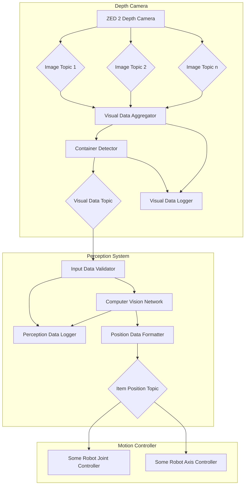

<link rel="stylesheet" href="../styles/styles.css" type="text/css">

> *[This template can be adapted as necessary (i.e., with good reason) to suit the project specifics.]*

<!-- TOC ignore:true -->
# Robot Vision System For A Pick And Place Task
<!--
	Co-Author: @dau501
	Editor(s):
	Year: 2023
-->

`System Architecture Design and Research Report`

<!-- TOC ignore:true -->
## Industry Project 24
List of your Names:

|Name|Position|Email|
|:-|:-|:-|
|@Slothman1|Team Leader/Client Liaison|id@swin.student.edu.au|
|@dau501|Development Manager/Planning Manager|id@swin.student.edu.au|
|@finnmcgearey|Support Manager/Developer|id@swin.student.edu.au|
|@vkach|Quality Manager/Developer|id@swin.student.edu.au|
|@NickMcK14|Support Manager/Developer|id@swin.student.edu.au|
|@Huy-GV|Quality Manager/Developer|id@swin.student.edu.au|

<!-- SUBJECT CODE, NAME, SEMESTER AND DATE -->

```gherkin
@Note:
Please read carefully.
Throughout this document, all text in RED ITALICS should be replaced with data relevant to your project.
Delete all the explanatory text in RED, including this box before submission.
```

<div class="page"/><!-- page break -->

# DOCUMENT SIGN OFF
|Name|Position|Signature|Date|
|:-|:-|:-|:-|
|@Slothman1|Team Leader/Client Liaison|student_signature(&emsp;)|DD/MM/2023|
|@dau501|Development Manager/Planning Manager|student_signature(&emsp;)|DD/MM/2023|
|@finnmcgearey|Support Manager/Developer|student_signature(&emsp;)|DD/MM/2023|
|@vkach|Quality Manager/Developer|student_signature(&emsp;)|DD/MM/2023|
|@NickMcK14|Support Manager/Developer|student_signature(&emsp;)|DD/MM/2023|
|@Huy-GV|Quality Manager/Developer|student_signature(&emsp;)|DD/MM/2023|

> *[When document is finalised for submission, all team members must affix their signature in the Document Sign Off table]*\
> ***[No-one should sign unless they have read the report and agree with it.]***

# CLIENT SIGN OFF
|Name|Position|Signature|Date|
|:-|:-|:-|:-|
|@FelipMarti|Research Fellow|<br/>|&emsp;/&emsp;/2023|

|Organisation|
|:-|
|Swinburne's Factory of the Future<br/><br/><br/><br/>|

> *[Client to sign off on the Software Design to signify they agree with the design]*

<div class="page"/><!-- page break -->

# Introduction
> *[In this opening, briefly*
> * *Discuss the **software/system** that will be developed;*
> * *Define the purpose of this **Software Design and Research Report** and identify its target reader or audience.]*

## Overview
> *[Provide an overview (or executive summary) of this document]*

## Definitions, Acronyms and Abbreviations
> *[Provide the definition of all terms, acronyms, and abbreviations used in this document.]*

# Problem Analysis
> *[This section provides a high-level analysis of the SRS of the target software system from the viewpoint of developing a design solution for it.]*

## System Goals and Objectives
> *[Summarise the high-level system goals and objectives, and refer to the SRS document.]*

## Assumptions
> *[List and discuss the assumptions you have made in developing the system design (as presented in this document).]*

## Simplifications (if any)
> *[List and discuss the simplifications that have been made in developing the system design.]*

<div class="page"/><!-- page break -->

# High-Level System Architecture and Alternatives
> *[Describe, using appropriate models and notations, the chosen **high-level** architecture of the software system that will be developed.*\
> *Also discuss two additional architecture alternatives that have been explored but not chosen.*\
> *This is a refinement of the high-level architecture discussed in the SRS.]*
>
> *Note that this section is about the high-level architecture design (rather than a lower-level detailed design in the next section).*

## System Architecture
This section explores the chosen architectural design (pub-sub) in greater detail by representing it in a component-and-connector (C&C) view.
C&C focuses on illustrating the relationship between elements within the system at runtime.
Elements with behaviour are known as *components* while those representing interactions between such components are known as *connectors*.

The established components in the perception system are the Depth Camera, the Perception System and its subscribers,
which are collectively known as the Motion Controller.
A core component that was omitted from the introduction section is the message broker, which allows subscribers to selectively receive published data.
There are two main types of message brokers:
* Content-based: subscribers declare the properties of the type of messages they are interested in,
which is then used by the broker to filter matching messages from the publisher.
* Topic-based (__preferred__): subscribers communicates their intentions by subscribing themselves to _topics_, which represent isolated logical channels.
This is chosen as the broker mechanism for the new perception system because it is supported by ROS2, the Depth Camera, and
is intended to work with sensory data flow i.e. the visual input stream from the Depth Camera.
Topics are the connectors for the main three components.

The below diagrams provides a detailed view of the components within the system:


### Depth Camera
The Depth Camera provides the rest of the system with visual data and consists of sub-components described below:
* __Visual Data Logger__\
The Data Logger component logs captured data to a specified location, be it a file or the console.
Logging data enables developers to diagnose runtime errors, identify abnormal behaviors and keep track of the system activity.
It is important that this component is started early and remains fault-tolerant during the operations of the robot
so it can provide comprehensive insights into any occurring error.
* __Visual Data Aggregator__\
As the name suggests, this components directly interact with the APIs supported by the camera and return captured data.
The ZED 2 Depth Camera supports a wrapper for ROS2 that publishes various types of captured data to several topics.
However, it would be impractical for other components to subscribe to multiple topics so they will receive aggregated data from this component instead.
* __Container Detector__\
Items to be assembled by the robot arm are positioned on different types of containers.
These include the battery holder, the PCB chip holder, the assembly tray and the shell delivered by the conveyor belt.
This component is responsible for identifying the locations of these container, and return isolated image data for each location,
narrowing the scope of data that the computer vision system needs to process.
It takes the aggregated visual data from the __Visual Data Aggregator__ and separates them into multiple frames, each depicting only one type of container.

### Perception System
The role of the Perception system is to determines the presence of items-to-be-assembled at their designated positions.
This system subscribes to the __Visual Data Topic__ published by the Depth Camera and outputs a data structure that specifies which items are present.
This information is then published to __Item Position Topic__.

This system is composed of the following items:
* __Input Data Validator__\
The visual data published by the Depth Camera is likely to be complex and potentially unprocessable.
To maintain high accuracy, data must be passed to this sub-component to determine whether they are formatted correctly.
* __Perception Data Logger__\
The perception system needs to retains information about the data it retrieved, its outputs, confidence level and other metadata.
This data is useful for telemetry, debugging and computer vision model training.
* __Computer Vision Network__\
This is the core component of the Perception System, which detects the presence of items to be assembled based on validated input data.
* __Position Data Formatter__\
The raw output of __Computer Vision Network__ is not public to other components since it is most likely not useful to them.
The results of the data prediction model should only include boolean data representing the presence/absence of an item.
This data is then published to the __Item Position Topic__, subscribed to by nodes pertaining to the motion control of the robot.

### Motion Controller
This component represents the system that controls the movement of the robot arm.
At the present stage, the robot is already capable of performing pick-and-place tasks accurately.
With the addition of the computer vision system, the Motion Controller should make decisions based on visual data received through the **Item Position Topic**.
Since the control system already exists, it will simply be represented by 2 components:
* **Some Robot Axe Controller**\
This hypothetical component controls motion of the axes of the robot arm.
* **Some Robot Joint Controller**\
This hypothetical component controls motion of the joints of the robot arm.

## Other Alternative Architectures Explored
> *[Present and discuss two additional architecture alternatives that have been explored and*
> *provide the rationale as to why they are considered inferior to the chosen architecture.]*

<div class="page"/><!-- page break -->

# Research and Investigations
> *[In this part of the report, outline and detail the research that has been undertaken during the requirements analysis and system design stage.*\
> *Theses research efforts may be related to **understanding** the system's business/application domain, system design*
> *(eg, similar existing systems, architecture styles and patterns, etc), technological platforms and programming languages, and so on.]*

## Research into Application Domain
> *[Research into the application domain goes here.]*

## Research into System Design
> *[Research into the system design goes here.]*

## Research into Technical Platforms, Languages and Tools
> *[Research into the technical platforms, programming languages and tools goes here.]*

## Other Research
> *[Research into other aspects  of the project/system goes here.]*

<div class="page"/><!-- page break -->

# References
> *[If you have used information from published sources, show where it came from here (and cite them in the relevant places of this report).*\
> *Use the Harvard system of citation (or another system, but be consistent).*\
> *For instance, they may be books, journal articles, or websites.]*

> ***[Your reference list entry must be in the form of***\
> &emsp; **Author, Initial(s) Year, *Title of Document/Webpage/Website*, Organisation/Host, viewed Day Month Year, &lt;URL>.**
>
> &emsp; example
>
> &emsp; Yates, J 2009, Tax expenditures and housing, Australian Housing and Urban Research Institute, viewed 12 November 2013,\
> &emsp; <http://www.ahuri.edu.au/publications/download/ahuri_judith_yates_research_paper>.]
>
> ***[Your in-text may be in the form of***
> * **Direct quote**\
> "Most official estimates ..." (Yates 2009).
> * **Paraphrase**\
> Yates (2009) looked at the equity implications of tax ...]
>
> ***[For more information on the Harvard style guide, refer to***\
> &emsp; <http://www.swinburne.edu.au/lib/studyhelp/harvard_style.html>]
