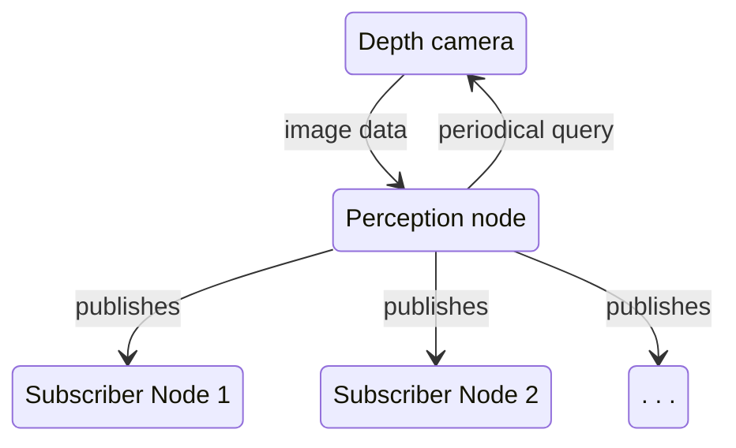

<link rel="stylesheet" href="../styles/styles.css" type="text/css">

> *[This template can be adapted as necessary (i.e., with good reason) to suit the project specifics.]*

<!-- TOC ignore:true -->
# Robot Vision System For A Pick And Place Task
<!--
	Co-Author: @dau501
	Editor(s):
	Year: 2023
-->

`System Architecture Design and Research Report`

<!-- TOC ignore:true -->
## Industry Project 24
List of your Names:

|Name|Position|Email|
|:-|:-|:-|
|@Slothman1|Team Leader/Client Liaison|id@swin.student.edu.au|
|@dau501|Development Manager/Planning Manager|id@swin.student.edu.au|
|@finnmcgearey|Support Manager/Developer|id@swin.student.edu.au|
|@vkach|Quality Manager/Developer|id@swin.student.edu.au|
|@NickMcK14|Support Manager/Developer|id@swin.student.edu.au|
|@Huy-GV|Quality Manager/Developer|id@swin.student.edu.au|

<!-- SUBJECT CODE, NAME, SEMESTER AND DATE -->

```gherkin
@Note:
Please read carefully.
Throughout this document, all text in RED ITALICS should be replaced with data relevant to your project.
Delete all the explanatory text in RED, including this box before submission.
```

<div class="page"/><!-- page break -->

# DOCUMENT SIGN OFF
|Name|Position|Signature|Date|
|:-|:-|:-|:-|
|@Slothman1|Team Leader/Client Liaison|student_signature(&emsp;)|DD/MM/2023|
|@dau501|Development Manager/Planning Manager|student_signature(&emsp;)|DD/MM/2023|
|@finnmcgearey|Support Manager/Developer|student_signature(&emsp;)|DD/MM/2023|
|@vkach|Quality Manager/Developer|student_signature(&emsp;)|DD/MM/2023|
|@NickMcK14|Support Manager/Developer|student_signature(&emsp;)|DD/MM/2023|
|@Huy-GV|Quality Manager/Developer|student_signature(&emsp;)|DD/MM/2023|

> *[When document is finalised for submission, all team members must affix their signature in the Document Sign Off table]*\
> ***[No-one should sign unless they have read the report and agree with it.]***

# CLIENT SIGN OFF
|Name|Position|Signature|Date|
|:-|:-|:-|:-|
|@FelipMarti|Research Fellow|<br/>|&emsp;/&emsp;/2023|

|Organisation|
|:-|
|Swinburne's Factory of the Future<br/><br/><br/><br/>|

> *[Client to sign off on the Software Design to signify they agree with the design]*

<div class="page"/><!-- page break -->

# Introduction
> *[In this opening, briefly*
> * *Discuss the **software/system** that will be developed;*
> * *Define the purpose of this **Software Design and Research Report** and identify its target reader or audience.]*

## Overview
> *[Provide an overview (or executive summary) of this document]*

## Definitions, Acronyms and Abbreviations
> *[Provide the definition of all terms, acronyms, and abbreviations used in this document.]*

# Problem Analysis
> *[This section provides a high-level analysis of the SRS of the target software system from the viewpoint of developing a design solution for it.]*

## System Goals and Objectives
> *[Summarise the high-level system goals and objectives, and refer to the SRS document.]*

## Assumptions
> *[List and discuss the assumptions you have made in developing the system design (as presented in this document).]*

## Simplifications (if any)
> *[List and discuss the simplifications that have been made in developing the system design.]*

<div class="page"/><!-- page break -->

# High-Level System Architecture and Alternatives
Among the software requirements of the project is the integration with the existing robot control system which uses ROS2.
Said system uses a publisher-subscriber model and divides components into individual "nodes",
each of which can subscribe to or publish messages to another node in the network.

## Preferred architecture
The addition of the perception system is envisioned to be encapsulated in one software module and
used a by a single node in a publisher-subscriber (pub-sub) architecture.
The diagram below captures the high level view of the system.



This design ensures modularity by encapsulating the entire computer vision system into its own module,
enabling independent development of other components, such as the robot arm control system.

The publisher-subscriber architecture promotes a loosely-coupled relationship between the perception system and other related components.
By using an asynchronous messaging model, the pub-sub architecture facilitates real-time communication between multiple components which
demand that the sender is not blocked waiting for the response or blocked only for a very limited duration.

If the client wishes to extend the capabilities of the robot arm beyond the scope defined in this project,
they can easily register new components to the perception node and retrieve visual data without changes to the rest of the system.

## Alternatives
### Messaging queue
An alternative architecture considered for this project is the messaging queue system.
In this system, visual data is pushed into a message queue and clients can asynchronously retrieve and process that data.

Similar to the pub-sub model, the message queue decouples consumers from producers and facilitates asynchronous data transfers.
However a single queue is limited to only one consumer hence multiple queues are needed, adding overhead that can harm performance.

### Multiple layers
As the name suggests, the system is divided into multiple layers, each with a well-defined responsibility.
The software system in this particular project may be divided into 3 layers: the Perception layer which process inputs,
the Movement layer which computes the desired robot movement and the Command layer which translates these movements into commands.

A significant drawback of this model is the lack of flexibility as newly added components must either be fitted into an existing layer or
the system will need modifications to accommodate said components.

## System Architecture
> *[Present the system architecture in this section.*\
> *A Component-and-Connector view and a Deployment Allocation view (or some alternatives of similar nature) with the necessary descriptions and*
> *justifications are expected as the minimum.]*

## Other Alternative Architectures Explored
> *[Present and discuss two additional architecture alternatives that have been explored and*
> *provide the rationale as to why they are considered inferior to the chosen architecture.]*

<div class="page"/><!-- page break -->

# Research and Investigations
> *[In this part of the report, outline and detail the research that has been undertaken during the requirements analysis and system design stage.*\
> *Theses research efforts may be related to **understanding** the system's business/application domain, system design*
> *(eg, similar existing systems, architecture styles and patterns, etc), technological platforms and programming languages, and so on.]*

## Research into Application Domain
> *[Research into the application domain goes here.]*

## Research into System Design
> *[Research into the system design goes here.]*

## Research into Technical Platforms, Languages and Tools
> *[Research into the technical platforms, programming languages and tools goes here.]*

## Other Research
> *[Research into other aspects  of the project/system goes here.]*

<div class="page"/><!-- page break -->

# References
> *[If you have used information from published sources, show where it came from here (and cite them in the relevant places of this report).*\
> *Use the Harvard system of citation (or another system, but be consistent).*\
> *For instance, they may be books, journal articles, or websites.]*

> ***[Your reference list entry must be in the form of***\
> &emsp; **Author, Initial(s) Year, *Title of Document/Webpage/Website*, Organisation/Host, viewed Day Month Year, &lt;URL>.**
>
> &emsp; example
>
> &emsp; Yates, J 2009, Tax expenditures and housing, Australian Housing and Urban Research Institute, viewed 12 November 2013,\
> &emsp; <http://www.ahuri.edu.au/publications/download/ahuri_judith_yates_research_paper>.]
>
> ***[Your in-text may be in the form of***
> * **Direct quote**\
> "Most official estimates ..." (Yates 2009).
> * **Paraphrase**\
> Yates (2009) looked at the equity implications of tax ...]
>
> ***[For more information on the Harvard style guide, refer to***\
> &emsp; <http://www.swinburne.edu.au/lib/studyhelp/harvard_style.html>]
