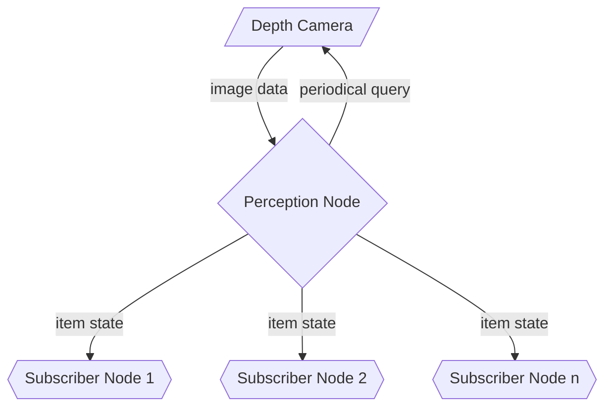

<link rel="stylesheet" href="../styles/styles.css" type="text/css">

> *[This template can be adapted as necessary (i.e., with good reason) to suit the project specifics.]*

<!-- TOC ignore:true -->
# Robot Vision System For A Pick And Place Task
<!--
	Co-Author: @dau501
	Editor(s):
	Year: 2023
-->

`System Architecture Design and Research Report`

<!-- TOC ignore:true -->
## Industry Project 24
List of your Names:

|Name|Position|Email|
|:-|:-|:-|
|@Slothman1|Team Leader/Client Liaison|id@swin.student.edu.au|
|@dau501|Development Manager/Planning Manager|id@swin.student.edu.au|
|@finnmcgearey|Support Manager/Developer|id@swin.student.edu.au|
|@vkach|Quality Manager/Developer|id@swin.student.edu.au|
|@NickMcK14|Support Manager/Developer|id@swin.student.edu.au|
|@Huy-GV|Quality Manager/Developer|id@swin.student.edu.au|

<!-- SUBJECT CODE, NAME, SEMESTER AND DATE -->

```gherkin
@Note:
Please read carefully.
Throughout this document, all text in RED ITALICS should be replaced with data relevant to your project.
Delete all the explanatory text in RED, including this box before submission.
```

<div class="page"/><!-- page break -->

# DOCUMENT SIGN OFF
|Name|Position|Signature|Date|
|:-|:-|:-|:-|
|@Slothman1|Team Leader/Client Liaison|student_signature(&emsp;)|DD/MM/2023|
|@dau501|Development Manager/Planning Manager|student_signature(&emsp;)|DD/MM/2023|
|@finnmcgearey|Support Manager/Developer|student_signature(&emsp;)|DD/MM/2023|
|@vkach|Quality Manager/Developer|student_signature(&emsp;)|DD/MM/2023|
|@NickMcK14|Support Manager/Developer|student_signature(&emsp;)|DD/MM/2023|
|@Huy-GV|Quality Manager/Developer|student_signature(&emsp;)|DD/MM/2023|

> *[When document is finalised for submission, all team members must affix their signature in the Document Sign Off table]*\
> ***[No-one should sign unless they have read the report and agree with it.]***

# CLIENT SIGN OFF
|Name|Position|Signature|Date|
|:-|:-|:-|:-|
|@FelipMarti|Research Fellow|<br/>|&emsp;/&emsp;/2023|

|Organisation|
|:-|
|Swinburne's Factory of the Future<br/><br/><br/><br/>|

> *[Client to sign off on the Software Design to signify they agree with the design]*

<div class="page"/><!-- page break -->

# Introduction
Project 24 aims to enhance cobot's capabilities by providing it with a perception system to perform pick and place tasks.
The robot currently performs these tasks without any form of perception system, and the position of the object to pick and place is predefined.

Project 24 will utilise state-of-the-art technologies in computer vision (CV), sensors, robotics, and
artificial intelligence (AI) to develop a real-time object detection, processing, and
analysis system that will provide the robot with the ability to continuously learn and adapt to it's environment.

This document will outline the system's general design, research requirements, and project management approach for successful completion of the project.\
Finally, this document will provide sufficient information on the design of the system such that those less involved can easily understand the project,
particularly clients and project leads.

## Overview
The purpose of this document is to provide a comprehensive overview of the system, outlining its key components and functionalities.
By presenting the system in a high-level way, this document aims to give a clear understanding of how the system is intended to operate and what it is capable of.

To achieve this goal, the document will utilise a range of visual aids, including diagrams and designs, to help illustrate the system's architecture and functionality.
Through these discussions, readers will be able to gain a thorough understanding of the system's capabilities,
including its use of CV, Robot Operating System 2 (ROS2), and ML for object recognition.

While this document will cover many of the fields that will require researching by the team,
it is important to note that it will not delve into low-level designs such as class diagrams and pseudocode.
Instead, it will focus on providing a high-level overview of the system's design, leaving the detailed implementation to be addressed in subsequent documents.

Finally, it is important to recognise that this document will not include the research being conducted on specific hardware components or implementation details.
Rather, it will provide a broad overview of the system's design and functionality, leaving the specifics to be addressed in future research and implementation efforts.

## Definitions, Acronyms and Abbreviations
> *[Provide the definition of all terms, acronyms, and abbreviations used in this document.]*

# Problem Analysis
The FOF cobot lacks a perception system, which limits its capabilities to moving objects that are located through pre-programmed coordinates,
therefore reducing the efficiency for pick and place tasks.
The proposed perception system will be built with cutting edge and state-of-the-art technologies,
primarily CV through the use of OpenCV and deep ML algorithms built with PyTorch.

Working in tandem these systems will both improve the efficiency of pick and place tasks and accommodate for disruptions in required materials.
The depth camera will integrate with the cobot through a software system, this system will be primarily running of the Ubuntu 22.04 LTS OS.
Within this system ROS2 will be running and be in control of moving the robot; however, without instructions this movement wont be improved from the current iteration.

The depth camera will utilise technologies mentioned above; primarily OpenCV to analyse the data and a PyTorch algorithm to use the visual data.
The enhanced design will allow for the cobot to have error margins and autonomously accommodate them and work around them,
this definitively improving the cobots current capabilities.
Additionally, the solution must be a standalone program to replace the current Programmable Logic Controller (PLC) system.

## System Goals and Objectives
> *[Summarise the high-level system goals and objectives, and refer to the SRS document.]*

## Assumptions
> *[List and discuss the assumptions you have made in developing the system design (as presented in this document).]*

## Simplifications (if any)
> *[List and discuss the simplifications that have been made in developing the system design.]*

<div class="page"/><!-- page break -->

# High-Level System Architecture and Alternatives
Among the software requirements of Project 24, is the integration with the existing robot control system which uses ROS2.
Said system uses a publisher-subscriber (pub-sub) model and divides components into individual "nodes",
each of which can subscribe to or publish messages to another node in the network.
The architecture for the additional perception software system must be compatible with the existing ROS2 design whilst maintaining modularity and
loose-coupling between individual components.
Although the project has established that the Depth Camera is the main tool that retrieves image inputs,
the new perception system should ideally encapsulate this detail and communicates visual data via an abstracted format.

## Preferred Architecture
The addition of the perception system is envisioned to be encapsulated in one software module and used a by a single node in a pub-sub architecture.
The diagram below captures the high-level view of the system.



This design ensures modularity by encapsulating the entire computer vision system into its own module,
enabling independent development of other components, such as the robot arm control system.

The pub-sub architecture promotes a loosely-coupled relationship between the perception system and other related components.
By using an asynchronous messaging model, the pub-sub architecture facilitates real-time communication between multiple components,
which demand that the sender is not blocked waiting for the response or blocked only for a very limited duration.
This design is also consistent with the primary architecture used by ROS2, and will be further explored in the [System Architecture](#system-architecture) section.

If the client wishes to extend the capabilities of the robot arm beyond the scope defined in this project,
they can easily register new components to the perception node and retrieve visual data without changes to the rest of the system.

## Alternatives
### Messaging Queue
An alternative architecture considered for this project is the messaging queue system.
In this system, visual data is pushed into a message queue and clients can asynchronously retrieve and process that data.

Similar to the pub-sub model, the message queue decouples consumers from producers and facilitates asynchronous data transfers.
However, a single queue is limited to only one consumer hence multiple queues are needed, adding overhead that can harm performance.

### Multiple Layers
As the name suggests, the system is divided into multiple layers, each with a well-defined responsibility.
The software system in this particular project may be divided into 3 layers:
* Perception Layer, which process inputs.
* Movement Layer, which computes the desired robot movement.
* Command Layer, which translates these movements into commands.

A significant drawback of this model is the lack of flexibility as newly added components must either be fitted into an existing layer or
the system will need modifications to accommodate said components.

## System Architecture
> *[Present the system architecture in this section.*\
> *A Component-and-Connector view and a Deployment Allocation view (or some alternatives of similar nature) with the necessary descriptions and*
> *justifications are expected as the minimum.]*

## Other Alternative Architectures Explored
> *[Present and discuss two additional architecture alternatives that have been explored and*
> *provide the rationale as to why they are considered inferior to the chosen architecture.]*

<div class="page"/><!-- page break -->

# Research and Investigations
> *[In this part of the report, outline and detail the research that has been undertaken during the requirements analysis and system design stage.*\
> *Theses research efforts may be related to **understanding** the system's business/application domain, system design*
> *(eg, similar existing systems, architecture styles and patterns, etc), technological platforms and programming languages, and so on.]*

## Research into Application Domain
> *[Research into the application domain goes here.]*

## System Design
The system will consist of a perception system, and a robotic control program.

The vision system uses a ZED 2 Depth Camera.
The Depth Camera uses an 8-element lens with optically corrected distortion and
a wider f/1.8 aperture, the Depth Camera's field of view extends to 120&deg; and is capable of recording in, 720p, 1080p and 2.2K resolutions.
The perception system will use the images recorded by the Depth Camera and AI-related libraries in Python such as PyTorch and
OpenCV to perform real-time object detection, processing, and analysis to find the position of the chips.

Training the AI will require a collection of images called a dataset (Towards Data Science, 2018).
The dataset will contain hundreds to thousands of sample images of the environment we want the artificial intelligence model to recognize.
The AI will be designed for continuous learning and adaptation to new object types.
Every photo taken after the system's implementation will be stored in the data set and will be used to further train the AI.
The perception system will pass location data to the robotic control system automatically when the systems require location data, needing no human intervention.

The software system will interact with the ROS2 and Ubuntu systems,
with ROS2 providing movement instructions for the cobot and Ubuntu being used to run ROS2 and integrate with the provided hardware.
Within the ROS2 framework, all programs are considered nodes and serve a single modular purpose. 
The ROS2 nodes and the vision system nodes will communicate by actions. 
In ROS2 actions allow you to execute long running tasks, provide regular feedback, and are cancellable.
They consist of three parts: a goal, feedback, and a result.
An *action client* node sends a goal to an *action server* node that acknowledges the goal and returns a stream of feedback and a result.
This will create a feedback loop allowing the perception system and the robotic system to be in constant communication.
The data sent out between nodes can be recorded and replayed using bags.
This is useful for troubleshooting issues such as actions not being performed correctly and will help identify exactly what the issue it.

The system will also prioritize non-functional requirements such as reliability, modularity, security, and performance.

## Research into Technical Platforms, Languages and Tools
> *[Research into the technical platforms, programming languages and tools goes here.]*

## Other Research
> *[Research into other aspects  of the project/system goes here.]*

<div class="page"/><!-- page break -->

# References
> *[If you have used information from published sources, show where it came from here (and cite them in the relevant places of this report).*\
> *Use the Harvard system of citation (or another system, but be consistent).*\
> *For instance, they may be books, journal articles, or websites.]*

> ***[Your reference list entry must be in the form of***\
> &emsp; **Author, Initial(s) Year, *Title of Document/Webpage/Website*, Organisation/Host, viewed Day Month Year, &lt;URL>.**
>
> &emsp; example
>
> &emsp; Yates, J 2009, Tax expenditures and housing, Australian Housing and Urban Research Institute, viewed 12 November 2013,\
> &emsp; <http://www.ahuri.edu.au/publications/download/ahuri_judith_yates_research_paper>.]
>
> ***[Your in-text may be in the form of***
> * **Direct quote**\
> "Most official estimates ..." (Yates 2009).
> * **Paraphrase**\
> Yates (2009) looked at the equity implications of tax ...]
>
> ***[For more information on the Harvard style guide, refer to***\
> &emsp; <http://www.swinburne.edu.au/lib/studyhelp/harvard_style.html>]
