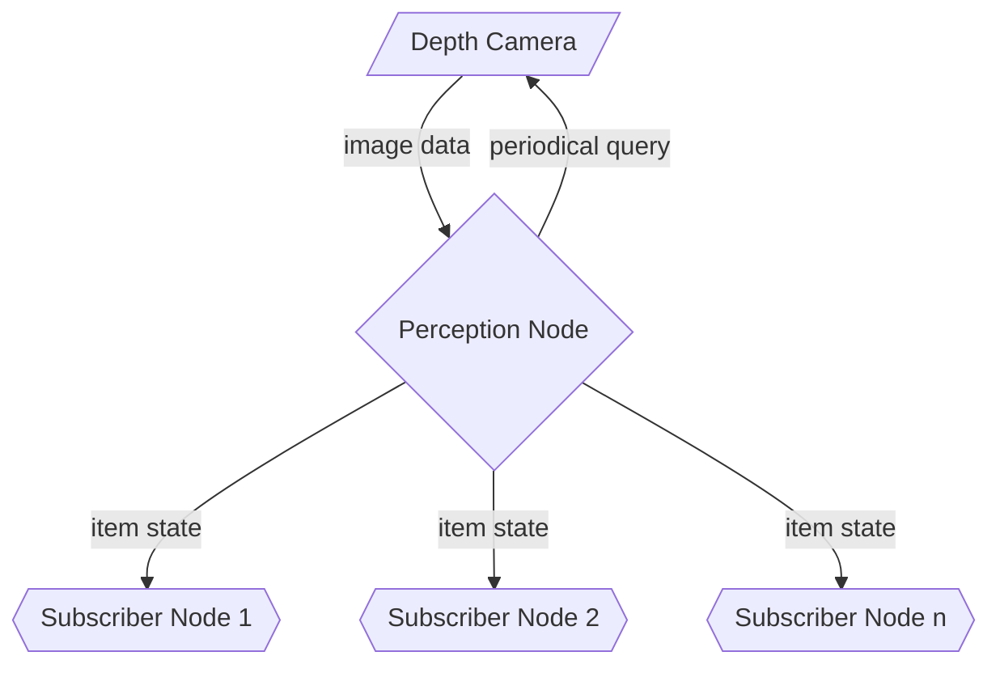
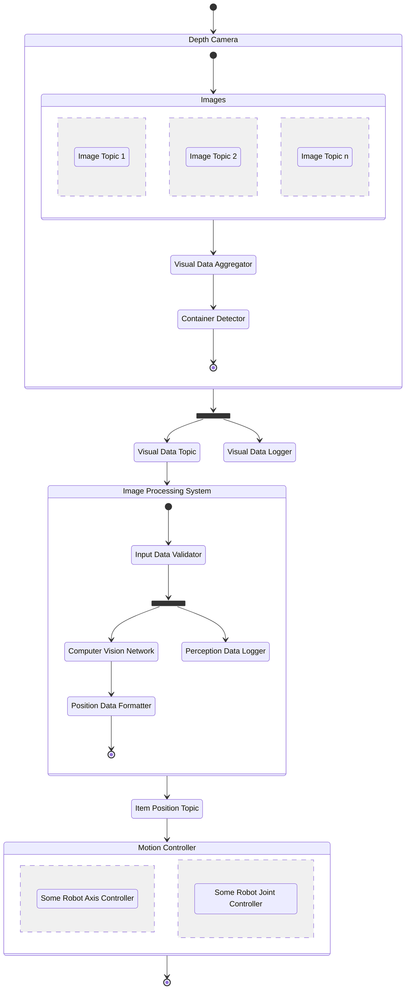
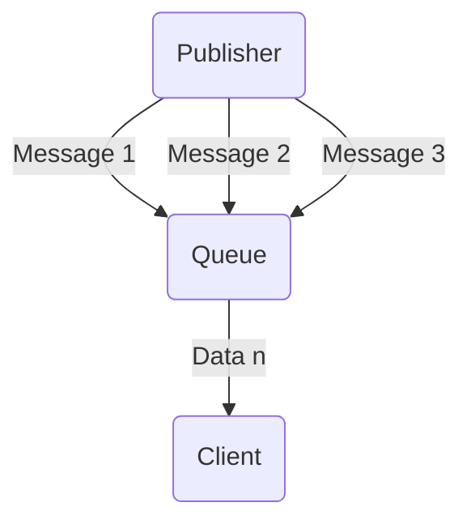
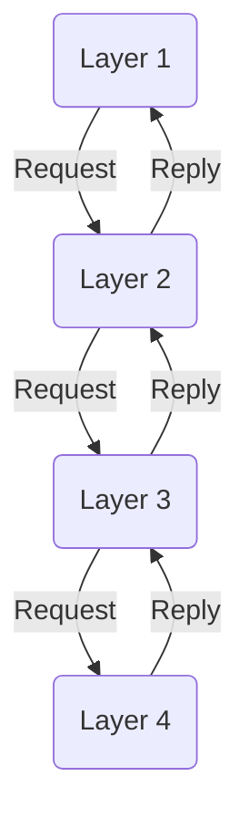

<link rel="stylesheet" href="../styles/styles.css" type="text/css">

> *[This template can be adapted as necessary (i.e., with good reason) to suit the project specifics.]*

<!-- TOC ignore:true -->
# Robot Vision System For A Pick And Place Task
<!--
	Co-Author: @dau501
	Editor(s):
	Year: 2023
-->

`System Architecture Design and Research Report`

<!-- TOC ignore:true -->
## Industry Project 24
List of your Names:

|Name|Position|Email|
|:-|:-|:-|
|@Slothman1|Team Leader/Client Liaison|id@swin.student.edu.au|
|@dau501|Development Manager/Planning Manager|id@swin.student.edu.au|
|@finnmcgearey|Support Manager/Developer|id@swin.student.edu.au|
|@vkach|Quality Manager/Developer|id@swin.student.edu.au|
|@NickMcK14|Support Manager/Developer|id@swin.student.edu.au|
|@Huy-GV|Quality Manager/Developer|id@swin.student.edu.au|

<!-- SUBJECT CODE, NAME, SEMESTER AND DATE -->

```gherkin
@Note:
Please read carefully.
Throughout this document, all text in RED ITALICS should be replaced with data relevant to your project.
Delete all the explanatory text in RED, including this box before submission.
```

<div class="page"/><!-- page break -->

# DOCUMENT SIGN OFF
|Name|Position|Signature|Date|
|:-|:-|:-|:-|
|@Slothman1|Team Leader/Client Liaison|student_signature(&emsp;)|DD/MM/2023|
|@dau501|Development Manager/Planning Manager|student_signature(&emsp;)|DD/MM/2023|
|@finnmcgearey|Support Manager/Developer|student_signature(&emsp;)|DD/MM/2023|
|@vkach|Quality Manager/Developer|student_signature(&emsp;)|DD/MM/2023|
|@NickMcK14|Support Manager/Developer|student_signature(&emsp;)|DD/MM/2023|
|@Huy-GV|Quality Manager/Developer|student_signature(&emsp;)|DD/MM/2023|

> *[When document is finalised for submission, all team members must affix their signature in the Document Sign Off table]*\
> ***[No-one should sign unless they have read the report and agree with it.]***

# CLIENT SIGN OFF
|Name|Position|Signature|Date|
|:-|:-|:-|:-|
|@FelipMarti|Research Fellow|<br/>|&emsp;/&emsp;/2023|

|Organisation|
|:-|
|Swinburne's Factory of the Future<br/><br/><br/><br/>|

> *[Client to sign off on the Software Design to signify they agree with the design]*

<div class="page"/><!-- page break -->

# Introduction
Project 24 aims to enhance cobot's capabilities by providing it with a perception system to perform pick and place tasks.
The robot currently performs these tasks without any form of perception system, and the position of the object to pick and place is predefined.

Project 24 will utilise state-of-the-art technologies in computer vision (CV), sensors, robotics, and
artificial intelligence (AI) to develop a real-time object detection, processing, and
analysis system that will provide the robot with the ability to continuously learn and adapt to it's environment.

This document will outline the system's general design, research requirements, and project management approach for successful completion of the project.\
Finally, this document will provide sufficient information on the design of the system such that those less involved can easily understand the project,
particularly clients and project leads.

## Overview
The purpose of this document is to provide a comprehensive overview of the system, outlining its key components and functionalities.
By presenting the system in a high-level way, this document aims to give a clear understanding of how the system is intended to operate and what it is capable of.

To achieve this goal, the document will utilise a range of visual aids, including diagrams and designs, to help illustrate the system's architecture and functionality.
Through these discussions, readers will be able to gain a thorough understanding of the system's capabilities,
including its use of CV, Robot Operating System 2 (ROS2), and ML for object recognition.

While this document will cover many of the fields that will require researching by the team,
it is important to note that it will not delve into low-level designs such as class diagrams and pseudocode.
Instead, it will focus on providing a high-level overview of the system's design, leaving the detailed implementation to be addressed in subsequent documents.

Finally, it is important to recognise that this document will not include the research being conducted on specific hardware components or implementation details.
Rather, it will provide a broad overview of the system's design and functionality, leaving the specifics to be addressed in future research and implementation efforts.

## Definitions, Acronyms and Abbreviations
> *[Provide the definition of all terms, acronyms, and abbreviations used in this document.]*

# Problem Analysis
The FOF cobot lacks a perception system, which limits its capabilities to moving objects that are located through pre-programmed coordinates,
therefore reducing the efficiency for pick and place tasks.
The proposed perception system will be built with cutting edge and state-of-the-art technologies,
primarily CV through the use of OpenCV and deep ML algorithms built with PyTorch.

Working in tandem these systems will both improve the efficiency of pick and place tasks and accommodate for disruptions in required materials.
The depth camera will integrate with the cobot through a software system, this system will be primarily running of the Ubuntu 22.04 LTS OS.
Within this system ROS2 will be running and be in control of moving the robot; however, without instructions this movement wont be improved from the current iteration.

The depth camera will utilise technologies mentioned above; primarily OpenCV to analyse the data and a PyTorch algorithm to use the visual data.
The enhanced design will allow for the cobot to have error margins and autonomously accommodate them and work around them,
this definitively improving the cobots current capabilities.
Additionally, the solution must be a standalone program to replace the current Programmable Logic Controller (PLC) system.

## System Goals and Objectives
The overall goal of this project is to implement an object perception system to allow the cobot to perform its required pick and place task.
This will require the creation of a program to detect the various objects it has to manipulate, a ML algorithm for it to improve its precision, and
a system to control the cobot's movement utilising the data collected from the perception system.

The system should allow the robot to complete its tasks without user input;
it should exclusively use the Depth Camera to perceive objects and move them around the environment.
The object detection and ML software should integrate with the robotic control system, implemented with ROS2 in Ubuntu 22.04 LTS,
to provide it with object position data, allowing the cobot to move to the correct position, pick up the object, and place it in the correct position.
The required movements and object manipulations will be performed by implementing nodes, topics, services, and actions in ROS2,
which will allow for a modular software design.

Additionally, the Depth Camera should be mounted in a centralised location, giving it full field of view of the task environment with all objects in frame.

## Assumptions
When developing the system design for this project, the following assumptions were made to further narrow down the scope of the project and ensure that it was feasible:
* The system will not have to account for parts that are not in their assigned locations.\
However, the system will have to halt when an object is detected and found to obstruct the cobot in completing its task.
* The fine motor controls for the cobot is already completed and accurate.\
As such, no development will need to be made to derive and implement transfer functions.
* The tools and software's used in the project (i.e., Depth Camera, cobot, and ROS2) are not subject to change.
* The types of objects the cobot will interact with are not subject to change.
* The locations of where the cobot will have to pick up objects is not subject to change.
* The locations of where the cobot will have to place objects is not subject to change.
* Objects that are almost identical, such as the PCB parts, will have labels to distinguish between different types, such as the PCB for a barometer vs. a thermometer.

## Simplifications
To ensure that the system that is being developed is feasible and able to be completed in the allotted time,
some aspects of the problem space have been designed to simplify the developmental process.

These aspects are as follows:
* The locations of parts that that the cobot will have to pick and place are predetermined.\
Therefore, the Depth Camera does not need to 'search' for parts, rather just check if a part is in a predetermined location.
* The cobot will only be allowed to perform a pick and place task if a part is in one of the predetermined locations.
* The individual parts that the cobot will have to pick and place will be color coded,
ensuring that the Depth Camera will be able to effectively differentiate between the required parts and the surrounding environment.

<div class="page"/><!-- page break -->

# High-Level System Architecture and Alternatives
Among the software requirements of Project 24, is the integration with the existing robot control system which uses ROS2.
Said system uses a publisher-subscriber (pub-sub) model and divides components into individual "nodes",
each of which can subscribe to or publish messages to another node in the network.
The architecture for the additional perception software system must be compatible with the existing ROS2 design whilst maintaining modularity and
loose-coupling between individual components.
Although the project has established that the Depth Camera is the main tool that retrieves image inputs,
the new perception system should ideally encapsulate this detail and communicates visual data via an abstracted format.

## Preferred Architecture
The addition of the perception system is envisioned to be encapsulated in one software module and used a by a single node in a pub-sub architecture.
The diagram below captures the high-level view of the system.



This design ensures modularity by encapsulating the entire computer vision system into its own module,
enabling independent development of other components, such as the robot arm control system.

The pub-sub architecture promotes a loosely-coupled relationship between the perception system and other related components.
By using an asynchronous messaging model, the pub-sub architecture facilitates real-time communication between multiple components,
which demand that the sender is not blocked waiting for the response or blocked only for a very limited duration.
This design is also consistent with the primary architecture used by ROS2, and will be further explored in the [System Architecture](#system-architecture) section.

If the client wishes to extend the capabilities of the robot arm beyond the scope defined in this project,
they can easily register new components to the perception node and retrieve visual data without changes to the rest of the system.

## Alternatives
### Messaging Queue
An alternative architecture considered for this project is the messaging queue system.
In this system, visual data is pushed into a message queue and clients can asynchronously retrieve and process that data.

Similar to the pub-sub model, the message queue decouples consumers from producers and facilitates asynchronous data transfers.
However, a single queue is limited to only one consumer hence multiple queues are needed, adding overhead that can harm performance.

### Multiple Layers
As the name suggests, the system is divided into multiple layers, each with a well-defined responsibility.
The software system in this particular project may be divided into 3 layers:
* Perception Layer, which process inputs.
* Movement Layer, which computes the desired robot movement.
* Command Layer, which translates these movements into commands.

A significant drawback of this model is the lack of flexibility as newly added components must either be fitted into an existing layer or
the system will need modifications to accommodate said components.

## System Architecture
This section explores the chosen architectural design, pub-sub, in greater detail by representing components, their sub-components and
explains their responsibilities and relationships with each other.
The section also discusses how the pub-sub mechanism is achieved at a high level in the  established development environment (ROS2 running on Ubuntu).
At a high level, the major components in the perception system are the **Depth Camera**, the **Image Processing System** and its subscribers,
which are collectively known as the **Motion Controller**.

A core component that was omitted earlier is the message broker, which allows subscribers to selectively receive published data.
There are two main types of message brokers:
* Content-based: subscribers declare the properties of the type of messages they are interested in,
which is then used by the broker to filter matching messages from the publisher.
* Topic-based (**preferred**): subscribers communicates their intentions by subscribing themselves to *topics*, which represent isolated logical channels.
Each topic concentrates on a distinct type of information, enabling publishers to categorize shared data without knowing which subscribers are listening to that topic.\
This is chosen as the broker mechanism for the system because of its support in ROS2 and suitability with the sensory data stream from the Depth Camera.
In this system, topics are the main medium through which the three primary components communicate, enabling asynchronous messaging and keeping components decoupled.

The below diagrams provides a detailed view of the components within the system.
The flow of the diagram represents the body of the main control loop, starting with the depth camera and ending with the robot movement.



### Depth Camera
The Depth Camera provides the rest of the system with visual data and consists of sub-components described below:
* **Visual Data Logger**\
The Data Logger component logs captured data to a specified location, be it a file or the console.
Logging data enables developers to diagnose runtime errors, identify abnormal behaviors and keep track of the system activity.
It is important that this component is started early and remains fault-tolerant during the operations of the robot,
so it can provide comprehensive insights into any occurring error.
* **Visual Data Aggregator**\
As the name suggests, this components directly interact with the APIs supported by the camera and return captured data.
The ZED 2 Depth Camera supports a wrapper for ROS2 that publishes various types of captured data to several topics.
However, it would be impractical for other components to subscribe to multiple topics so they will receive aggregated data from this component instead.
* **Container Detector**\
Items to be assembled by the robot arm are positioned on different types of containers.
These include the battery holder, the PCB chip holder, the assembly tray and the shell delivered by the conveyor belt.
This component is responsible for identifying the locations of these container, and return isolated image data for each location,
narrowing the scope of data that the computer vision system needs to process.
It takes the aggregated visual data from the **Visual Data Aggregator** and separates them into multiple frames, each depicting only one type of container.

### Image Processing System
The role of the Perception system is to determine the presence of items-to-be-assembled at their designated positions.
This system subscribes to the **Visual Data Topic** published by the Depth Camera and outputs a data structure that specifies which items are present.
This information is then published to **Item Position Topic**.

This system is composed of the following items:
* **Input Data Validator**\
The visual data published by the Depth Camera is likely to be complex and potentially unprocessable.
To maintain high accuracy, data must be passed to this sub-component to determine whether they are formatted correctly.
* **Perception Data Logger**\
The perception system needs to retains information about the data it retrieved, its outputs, confidence level and other metadata.
This data is useful for telemetry, debugging and computer vision model training.
* **Computer Vision Network**\
This is the core of the **Image Processing System**, which detects the presence of items to be assembled based on validated input data.
This sub-component represents the machine-learning network trained to detect the presence of objects at their designated position.
* **Position Data Formatter**\
The raw output of **Computer Vision Network** is not public to other components since it is most likely not useful to them.
The results of the data prediction model should only include boolean data representing the presence/absence of an item.
This data is then published to the **Item Position Topic**, subscribed to by nodes pertaining to the motion control of the robot.

### Motion Controller
This component represents the system that controls the movement of the robot arm.
At the present stage, the robot is already capable of performing pick-and-place tasks accurately.
With the addition of the computer vision system, the Motion Controller should make decisions based on visual data received through the **Item Position Topic**.
Since the control system already exists, it will simply be represented by 2 hypothetical components:
* **Some Robot Axis Controller**\
This hypothetical component controls motion of the axes of the robot arm.
* **Some Robot Joint Controller**\
This hypothetical component controls motion of the joints of the robot arm.

## Other Alternative Architectures Explored
### Messaging Queue
A message is data of any type thate needs to be transmitted and a queue in a line of messages.
A good example of a messaging queue is and email inbox, data can be published to the inbox then the publisher can complete other actions, without needing an imediate response.
The messages sent to the queue are held there until a client is ready to read them.
This is shown in the diagram below:

The client can read the published data at any time and can send a response at any time.
This is known as decoupling where two or more systems work together without being directly connected.
This means that changes can be made to one program without effecting the workings of other programs.
However, the project requires multiple programs to send requests and replys to other promgrams.
This would require many queues as to implement request and reply functionality between 2 programs requires a seprate queue for both the request and the reply.
The large number of queues would reduce the speed and effciency of the project hence why this architecture was not chosen.

### Multiple Layers
As the name suggests, the system is divided into multiple layers, each with a well-defined responsibility.
The software system in this particular project may be divided into 3 layers:
* Perception Layer, which process inputs.
* Movement Layer, which computes the desired robot movement.
* Command Layer, which translates these movements into commands.

A significant drawback of this model is the lack of flexibility as newly added components must either be fitted into an existing layer or
the system will need modifications to accommodate said components.

The layered architecture is defined by multiple layers that are stacked on top of each other, with each layer responsible for a different operation.
Only layers that are adjacent may communicate to one another and only the lower layers never call an upper layer.
The upper layers call the lower layers and the lower layers can only reply to upper layer.
This is described in the figure below:

As requests must flow through multiple layers without being able to skip over a layer, the time taken to execute tasks is greater when using this architecture.
The project requires multiple programs to interact with multiple other programs so it requires that layers can be skipped.
For this reason this architecture was not chosen.

<div class="page"/><!-- page break -->

# Research and Investigations
HeeHooVision conducted several research efforts to ensure the success of the project.\
These research efforts were classified into three categories:
1. Understanding The System's Business/Application Domain.
2. Exploring Similar Existing Systems.
3. Researching Technological Platforms and Programming Languages.

### Understanding The System's Business/Application Domain
HeeHooVision conducted research on the pick and place task, the FOF, and the robotics industry.\
This research aimed to provide insights into the problem at hand and the requirements for the solution.
HeeHooVision also looked into the client's needs and expectations to ensure the solution aligned with their goals.

### Exploring Similar Existing Systems
HeeHooVision conducted a thorough review of current technologies related to providing robots with vision systems to pick and place tasks.\
This research aimed to identify potential solutions and best practices that could be adopted or adapted for this project.
HeeHooVision also explored existing robotic vision systems and analysed their architecture and implementation to inform the design of the proposed system.

### Researching Technological Platforms and Programming Languages
HeeHooVision explored various software development methodologies and frameworks to find the best fit for the project.\
This research aimed to ensure that the system would be compatible with the required platforms and
that HeeHooVision had the necessary skills and resources to implement the system successfully.
HeeHooVision also researched the required hardware and software tools,
such as the Universal Robots UR5e robotic arm, ZED 2 Depth Camera, ROS2, C/C++, Python, OpenCV, and PyTorch.

### Additional Investigations and Research Efforts
HeeHooVision further covered many topics to assist with achieving the project, the topics involve other conducted research on:
* OpenCV to understand its capabilities and how it could be used for image processing in the project.
* Data collection, tagging, and organisation to ensure that the collected data was usable and accurate.
* ROS2 to understand its capabilities and how it could be used for robot programming.
* Python and C++ coding principles and best practices to ensure that the code was clean, efficient, and maintainable.
* Potential mounting options for the sensors to ensure that they were positioned correctly for accurate data collection.
* ML algorithms and techniques to explore their potential applications in the project.

HeeHooVision also conducted research into GitHub to ensure that the project was well-organised and easily accessible to team members.\
They explored different organisational strategies and established guidelines for version control and collaboration to ensure that the project ran smoothly.

## Research into Application Domain
> *[Research into the application domain goes here.]*

## Research into System Design
> *[Research into the system design goes here.]*

## Research into Technical Platforms, Languages and Tools
A variety of technical platforms, languages, and tools will be required to successfully complete the project.
This sections will discuss these aspects in further depth, explaining their use with respect to the project.

### Ubuntu 22.04 LTS
The client has specified that the software should run on Ubuntu 22.04 LTS, and therefore the programs will be developed on this operating system.
Additionally, because development will also be undertaken remotely, a virtual machine may also be required to be installed to use Ubuntu.
VirtualBox will be used in this case because it is easy to set up, but development at the FoF will be conducted with the provided computer.

Ubuntu makes frequent use of the terminal to perform commands and to aid with development; a good understanding of the terminal will be required.
Some basic commands that will be necessary are as follows:
* `ls` - Lists the folders and files in the current directory
* `cd [directory]` - Changes the directory to the specified directory
* `touch [file_name]` - Creates a new file
* `mkdir [directory_name]` - Makes a new directory
* `clear` - Clears the terminal screen
* `sudo apt install [package]` - `sudo` runs a command with root privileges, `apt` manages packages, and `install` installs a package
* `sudo apt update` & `sudo apt upgrade` - Updates package cache and installs the update, respectively

### ROS2
ROS2 is a collection of packages that will be used for developing the software for the robot system.
It includes various terminal commands, programming packages for C++ and Python, and data analysis tools that make development for robotics more efficient.

#### Terminal Commands
In order to access ROS2 commands in the terminal, the following command needs to be run each time a new terminal is started:

`source /opt/ros/humble/setup.bash`

To have ROS2 commands included in any terminal at startup, this command can be used:

`echo "source "source /opt/ros/humble/setup.bash" >> ~/.bashrc`

ROS2 commands are accessed by using the `ros2` command.
Some important commands include:
* `run [package] [executable]` - Runs an executable file in a package, can be used to start nodes or other ROS2 structures
* `[type] list` - Lists all of the specified type which can be: `node`, `topic`, `action`, etc.
* `[type] info` - Returns a list of subscribers, publisher, services, and actions associated with that node
* `rqt_graph` - Starts an applications that displays the ROS2 graph, containing all nodes, topics, actions, services, etc.
* `pkg create --build-type [type] [package_name]` - Creates a ROS2 package with the specified type (either `ament_cmake` or `ament_python` for C++ or Python) 

#### C++ and Python Libraries
ROS2 has two client libraries for C++ and Python that will be used, `rclcpp` and `rclpy` respectively.
The client libraries share many of the same method and class names to make switching development between the two languages easier.
Nodes, including publishers, subscribers, service clients, and
service servers are created by deriving a created class from the `Node` class defined in the client library.

Rather than creating a publisher, subscriber, client, or server by creating a separate class and linking it to a node, the methods `create_publisher()`,
`create_subscriber()`, `create_client()`, or `create_server()` can be called within the Node class.

Nodes are instantiated by using the `spin()` method in the `main()` method after `init()` is called and before `shutdown()` is called.

### UR5e Collaborative Robot Arm
The UR5e collaborative robot arm (cobot) is a versatile robotic arm with a payload of 5 kg, reach of 850 mm, and 6 degrees of freedom.
The payload limit is not necessary to consider because the mass of the objects it will be picking up in this project will be far below 5 kg.

However, the reach may be something to consider to define the boundaries of the cobot so as to not move an object out of bounds, damage the cobot, or injure somebody.
The 6 degrees of freedom allows it to translate and rotate objects in 3 directions and about 3 axes, enabling it to fully manipulate objects. 

### ZED 2 AI Stereo Camera
The ZED 2 camera utilises binocular vision to sense depth much like a human would, which will allow the perception system to detect objects and
their positions to a much higher precision.
It has a depth range between 0.2 m and 20 m and a 120 degree field of view giving it a wider detection area and allows for better tracking of object positions.

The ZED 2 supports multiple video resolutions and frame rates including 2.2K at 15 fps, 1080p at 30 fps or 15 fps, and 720p at 60 fps, 30 fps, or 15 fps.
Higher resolutions would allow for better object detection whereas higher frame rates would allow for better position tracking.

### OpenCV
OpenCV is a software library used for developing computer vision software.
The perception system will use OpenCV in Python to utilise the video from the ZED 2 camera to detect objects in its field of view.

### PyTorch
PyTorch is a machine learning framework that allows for development in Python.
This will be used in the perception system to improve the accuracy of the object detection by recording perception data and training the system with this data.

## Other Research
In addition to the research indicated so far, research will have to be conducted by HeeHooVision into the specific methods that AI tools, such as PyTorch and OpenCV,
may use to analyse the data received.
ML techniques that can be used to enhance and improve the performance of real-time object detection, processing and
continuous learning will have to be thoroughly researched as well.

HeeHooVision needs to research and generate relevant measures to ensure that metrics such as reliability, modularity, security, and performance are met and
maintained throughout the project.
In addition to this, mounting for the Depth Camera needs to be researched and developed.
However, preliminary considerations are that the Depth Camera will preferably be mounted to a V-slot rail system, meaning CAD designs and 3D printing may be required.

<div class="page"/><!-- page break -->

# References
> *[If you have used information from published sources, show where it came from here (and cite them in the relevant places of this report).*\
> *Use the Harvard system of citation (or another system, but be consistent).*\
> *For instance, they may be books, journal articles, or websites.]*

> ***[Your reference list entry must be in the form of***\
> &emsp; **Author, Initial(s) Year, *Title of Document/Webpage/Website*, Organisation/Host, viewed Day Month Year, &lt;URL>.**
>
> &emsp; example
>
> &emsp; Yates, J 2009, Tax expenditures and housing, Australian Housing and Urban Research Institute, viewed 12 November 2013,\
> &emsp; <http://www.ahuri.edu.au/publications/download/ahuri_judith_yates_research_paper>.]
>
> ***[Your in-text may be in the form of***
> * **Direct quote**\
> "Most official estimates ..." (Yates 2009).
> * **Paraphrase**\
> Yates (2009) looked at the equity implications of tax ...]
>
> ***[For more information on the Harvard style guide, refer to***\
> &emsp; <http://www.swinburne.edu.au/lib/studyhelp/harvard_style.html>]
