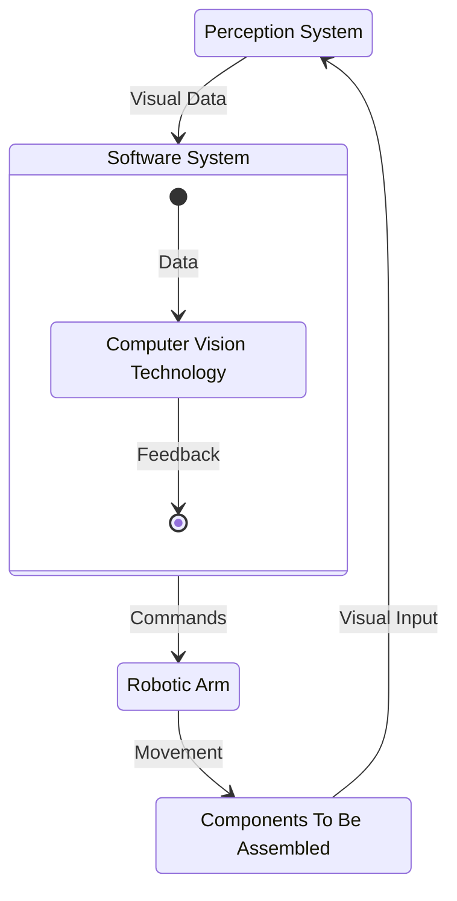
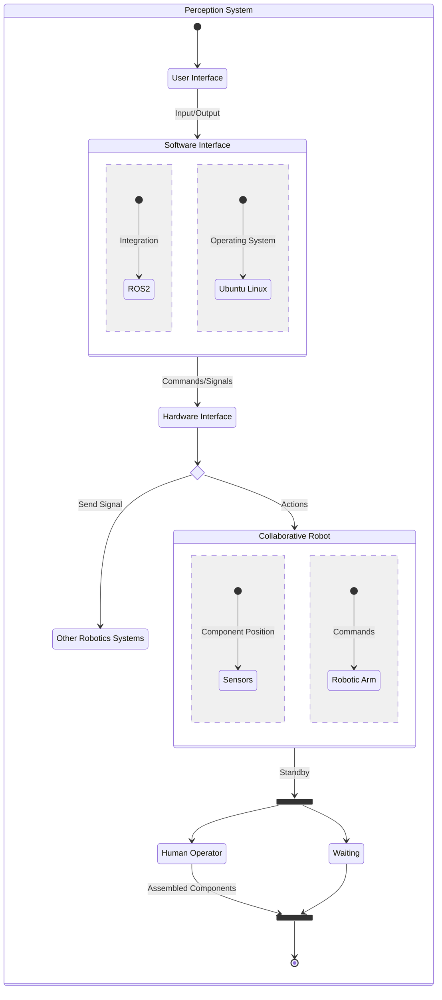

<link rel="stylesheet" href="../styles/styles.css" type="text/css">

<!-- TOC ignore:true -->
# Robot Vision System For A Pick And Place Task
<!--
	Co-Author: @dau501
	Editor(s):
	Year: 2023
-->

`System Requirements Specification`

<!-- TOC ignore:true -->
## Industry Project 24
List of your Names:

|Name|Position|Email|
|:-|:-|:-|
|@Slothman1|Team Leader/Client Liaison|id@swin.student.edu.au|
|@dau501|Development Manager/Planning Manager|id@swin.student.edu.au|
|@finnmcgearey|Support Manager/Developer|id@swin.student.edu.au|
|@vkach|Quality Manager/Developer|id@swin.student.edu.au|
|@NickMcK14|Support Manager/Developer|id@swin.student.edu.au|
|@Huy-GV|Quality Manager/Developer|id@swin.student.edu.au|

<!-- SUBJECT CODE, NAME, SEMESTER AND DATE -->

```gherkin
@Note:
Please read carefully.
Throughout this document, all text in RED ITALICS should be replaced with data relevant to your project.
Delete all the explanatory text in RED, including this box before submission.
```

<div class="page"/><!-- page break -->

# DOCUMENT SIGN OFF
|Name|Position|Signature|Date|
|:-|:-|:-|:-|
|@Slothman1|Team Leader/Client Liaison|student_signature(&emsp;)|DD/MM/2023|
|@dau501|Development Manager/Planning Manager|student_signature(&emsp;)|DD/MM/2023|
|@finnmcgearey|Support Manager/Developer|student_signature(&emsp;)|DD/MM/2023|
|@vkach|Quality Manager/Developer|student_signature(&emsp;)|DD/MM/2023|
|@NickMcK14|Support Manager/Developer|student_signature(&emsp;)|DD/MM/2023|
|@Huy-GV|Quality Manager/Developer|student_signature(&emsp;)|DD/MM/2023|

> *[When document is finalised for submission, all team members must affix their signature in the Document Sign Off table]*\
> ***[No-one should sign unless they have read the report and agree with it.]***

# CLIENT SIGN OFF
|Name|Position|Signature|Date|
|:-|:-|:-|:-|
|@FelipMarti|Research Fellow|<br/>|&emsp;/&emsp;/2023|

|Organisation|
|:-|
|Swinburne's Factory of the Future<br/><br/><br/><br/>|

> *[Client to sign off on the Project Plan to signify they agree with the plan]*

<div class="page"/><!-- page break -->

# Introduction
This project addresses the development and implementation of a perception system for a cobot to perform pick and place tasks.\
Located within the FOF the cobot will be used to demonstrate robotics capabilities, in this case with moving electronics autonomously to assist human workers.\
The robot currently operates on predefined positions, and the system implementation will enable the cobot to leverage computer vision and
artificial intelligence to find the locations of available items and autonomously manipulate them.

## Purpose
This SRS document is designed to serve as a roadmap for this project.
It comprehensively outlines the boundaries and requirements of the project to ensure the end product meets the needs of the client.\
Additionally, the document serves as a point of reference for the team throughout development cycles,
enabling them to maintain alignment with established standards and requirements.
The client and other stakeholders may use this document as a communication tool that informs them of high-level design details and
verifies that shared objectives are well understood.

## Scope
The project aims to design, develop and implement a perception system for a robot to perform pick and place tasks at the Factory of the Future.
The system will enable the robot to detect the position of objects that need to be picked up and placed, even if the objects are not in the predefined position.

The systems primary application is to improve the efficiency of pick and place tasks by the cobot at the Factory of the Future.
It aims to benefit the company by increasing productivity and working collaboratively with workers.
The objective is to provide the robot with a perception system that will enable it to perform pick and place tasks accurately, autonomously and efficiently.

The boundaries of the project are as follows:

The system will:
* Provide a perception system for the robot to perform pick and place tasks.
* Utilize specializations in Computer Vision, Sensors, Robotics, and AI.
* Require technical software development skills, specifically in C/C++, Python, OpenCV, PyTorch, and Robot Operating System (ROS2).
* Explore state-of-the-art technologies to provide the cobot with a vision system to pick and place objects.
* Allow the cobot to autonomously pick and place objects when they are needed.

The system will not:
* Perform any tasks other than picking and placing objects.
* Handle any tasks that do not require perception systems.
* Replace the entire robot system.
* Integrate with other systems than the cobot.

## Definitions, Acronyms and Abbreviations
The following definitions will be used consistently throughout the SRS document to ensure clarity and understanding:
* **Robot/Robotic Arm/cobot:**
The mechanical device (UR5e manufactured by Universal Robots) used to perform pick and place tasks.
* **Computer Vision/Perception System:**
The technology used to provide the robot with visual feedback of the environment.
* **Sensors/Depth Camera:**
The device (ZED 2 Camera developed by Stereolabs) used to detect the presence of objects and provide feedback to the robot.
* **AI:**
Artificial intelligence, the technology used to provide the robot with the ability to learn and improve its performance.
* **OpenCV:**
Open Source Computer Vision Library, a library of programming functions mainly aimed at real-time computer vision.
* **PyTorch:**
An open-source machine learning library based on the Torch library.
* **ROS2:**
Robot Operating System 2, a framework for building robot software applications.
* **SemVer:**
Semantic Versioning, Version Control/Software Versioning Strategy.
* **ML:**
Machine learning, A type of AI where the computer learns.
* **OS:**
Operating System.
* **SRS:**
Software Requirement Specification.
* **Project 24:**
The shorter alternative name of this project.\
The full name is *Robot Vision System For A Pick And Place Task*.
* **FOF:**
Factory of the Future, a Swinburne facility where the cobot is situated.
* **HeeHooVision:**
The name for the Capstone Team working on Project 24
* **ASAP:**
As Soon as Possible
* **COB:**
Close of Business (5:00 PM)

<div class="page"/><!-- page break -->

# Overall Description
Project 24 is a new and complete system that aims to provide a robot with a vision or sensing system to perform pick and place tasks.
Currently, the robot at the FOF is performing pick and place tasks without any sensing or vision-guided system.\
If the object to pick and place is not in the predefined position, the robot cannot perform the task.\
This project will enable the robot to perform these tasks by providing it with a vision or sensing system.

The project requires specialization in Computer Vision, Sensors, Robotics, and AI and software programming skills in C/C++, Python, OpenCV, PyTorch, and ROS2.
It will require research into state-of-the-art technologies to provide the robot with a vision system to pick and place objects.
The project is managed using Kanban and GitHub for implementation and source control.\
The project will also follow SemVer for version control, and the documentation will be in Markdown format.

Project 24 is a component of a larger system that involves the integration of Computer Vision, Sensors, Robotics, and AI technologies.
The vision or sensing system will enable the robot to detect and analyze objects in real-time, and
the ROS2 will allow for easy integration of the various system components.



## Product Features
The system recognises various components from a set of pre-determined locations and
performs a pick-and-place task to transfer them into a common tray for assembly.
The system responds to irregularities such as the absence of certain items in the least disruptive manner possible and
if necessary, stops completely and awaits human intervention.

## System Requirements
Software requirements specify the software required to deploy the system onto the robotic arm and
the depth camera whilst ensuring compatibility with the existing robotic software.\
The development phase involves two programming languages and associated libraries needed to construct said system.
* Production requirements:
	* Ubuntu 22.04 LTS OS.
	* ROS 2 software suite.
* Development requirements:
	* C++ and Python programming languages.
	* Computer Vision and AI-related libraries in Python.\
	Potential candidates include PyTorch, OpenCV, etc.

Hardware requirements specify the hardware required to perform the pick-and-place task based on varying visual inputs.
* Universal Robots UR5e robotic arm.
* ZED 2 depth camera mounted in a manner that captures all relevant items.

## Acceptance Criteria
This section outlines the operation of the robotic arm, as well as the associated depth camera and control software,
which will henceforth be referred to as "the system", under both normal and abnormal conditions.\
Under normal conditions, it is assumed that all items to be manipulated by the robotic arm are located and oriented according to pre-defined parameters.
The acceptance criteria for such conditions are listed below:
* The system picks up different items from a set of pre-defined locations and transfers them to a designated tray.
* The system recognises:
	* available spaces on the tray and positions items accordingly.
	* items and trays under various lighting conditions.
	* trays that have been emptied and returns them to the original position.

The following list specifies the acceptance criteria for conditions considered to be abnormal.\
"Abnormal" in this context refers to items that are absent, misaligned or incorrectly placed on the tray due to external interference.
* The system recognises absent items, in which case it:
	* searches for that item in another location, if available; or
	* stops and awaits human intervention.
* The system detects:
	* incorrect combinations of items on a tray, in which case it stops and awaits human intervention.
	* mal-oriented items, in which case it stops and awaits human intervention.

## Documentation
The software is delivered along with a variety of documents, each designed to serve specific purposes and provide a seamless, user-friendly experience.
These documents vary in scope and details, ranging from high-level tutorials to technical notes.

The following documents are provided with the software package:
* **User Manual:**
provides guidance on how to use offered features, including available best practices.\
It also include guidance on how to troubleshoot errors and perform quick fixes.
* **Installation Manual:**
provides instructions for installing, updating, and uninstalling of the software on supported machines.
* **Release Notes:**
highlights the changes and improvements made in each release of the software.
* **Development Notes:**
provides details about technical information of the software, including its architecture, design, algorithms, training data, etc.
Additionally, the document outlines test plans for the software, including unit tests and integration tests that outline test parameters and desired results.

<div class="page"/><!-- page break -->

# Functional Requirements
The system to be developed is a Robot Vision System for a Pick and Place Task.\
The system is designed to enable a robot to identify the objects that need to be picked up and placed.\
To achieve this, the system should have the following functionality:
* **Real-time Object Detection, Processing, and Analysis:**\
The system should be able to handle real-time object detection, processing, and analysis to ensure accuracy and speed.
* **Object Location Data Communication:**\
The system should be able to communicate the object location data to the robot arm.
* **Continuous Learning and Adaptation:**\
The system should have the ability to continuously learn and adapt to novel objects and locations.
* **Autonomous Systems:**\
The system should perform tasks independently without human interaction.

# Non-Functional (Quality) Requirements
Non-functional (quality) requirements are critical to ensure the success of Project 24.
These requirements specify the system's characteristics and
behaviors that are not related to its functionality but contribute to its overall performance and usability.

Here are the non-functional quality requirements for the software architecture and design of the Robot Vision System:
* **Reliability:**\
The system should be able to operate without failure for extended periods of time to ensure that the robot can complete pick and place tasks with minimal pauses.
A failure in this context refers to any instance where the robot stops and awaits human intervention.\
The reliability requirement should be verifiable by testing the system's performance over a period of time that is,
at a minimum, equivalent to number of hours assembly workers spend in a single day.
The system should also have the ability to handle unexpected conditions and avoid faulting.
* **Modularity:**\
The system should be designed with a modular architecture that facilitates the integration of different computer vision, sensor, robotics, and AI technologies,
as well as future upgrades and maintenance.
The system should be composed of interchangeable and independent modules, which can be modified or replaced without affecting the functionality of other modules.\
The modularity requirement should be verifiable by testing the system's ability to replace or add modules without causing any impact on the other modules.
This can be implemented by performing unit tests on individual components using stubs and mocks.
* **Security:**\
The system should be designed with security features to prevent unauthorized access, data breaches, and system failures.
The Robot Vision System is responsible for the operation of the robot in the FOF environment, and
any security vulnerabilities may cause significant damage to the system and its surroundings.
The development process should be iterative, with regular reviews and testing to ensure the non-functional quality requirements are met.\
The security requirement should be verifiable by testing the system's ability to prevent unauthorized access and data breaches.
Communication of the system with external networks should be restricted, traced and closely monitored.
* **Performance**:\
The time spent processing visual inputs by the system should not cause long pauses to the assembly line unless there is external interference.
The system should compute the most efficient sequence of moves to finish a pick-and-place cycle without impacting the human operator and other equipment.\
The requirement should be verifiable by measuring the average system processing time per assembly cycle in all situations,
except those caused by external interference that require human intervention.

<div class="page"/><!-- page break -->

# Interface Requirements
The software system does not operate independently but in conjunction with multiple actors.\
On the hardware front, it processes input from the depth camera and produces command for the robot arm.\
In terms of software, it interacts with the existing robot arm control system and associated toolkit.\
Communication with the human operator is conducted via a graphical interface.

## System In Context


The cobot system operates within a larger system that includes components such as the hardware interface,
other robotics systems, Ubuntu, robotic arm, and software interface.
The system integrates with ROS2 through the software interface to send commands/signals to the hardware interface for controlling the hardware components.

The hardware interface communicates with the other robotics systems to receive signals and with the cobot to send commands for actions.
The cobot, consisting of sensors for detecting component positions and a robotic arm for executing commands,
can be in a standby state or perform actions based on received signals.

The human operator interacts with the system for assembling components.
The system operates on the Ubuntu, providing the necessary environment for executing commands and integrating with other components.

## User Interfaces
Currently the system already has a GUI and this interface is used to manually override the robots commands.\
With an autonomous system the Robot should not have a GUI, or an advanced one, and in most cases the user shouldn't be modifying this.\
Overall, this Project already has an implemented GUI and we don't need to make/implement one.

## Hardware Interfaces
The software being developed is that of a perception system for a cobot, so the software will integrate with the:
* cobot
* sensors (ZED 2 camera)
* other robotics systems
* computer running the software; briefly overviewing how the system interacts is as follows:\
The computer running the software will be almost constantly running, the other robotics systems will send a signal to the software for the cobot.
From here the sensors will identify the location of available components then communicating that information to the cobot to retrieve and place the components.

## Software Interfaces
The software system will interact with ROS2 and Ubuntu systems.
Being a cobot, ROS2 will be the primary software used to integrate with the system, allowing the system to provide the cobot with movement instructions.
ROS2 runs best within Ubuntu systems, as a result the 22.04 LTS version will be used to run ROS2 and be the primary integration with provided hardware in this project.

## Communication Interfaces
For both security and practicality reasons the system will not be connected to a network.

<div class="page"/><!-- page break -->

# References (if any)
> *[If you have used information from published sources, show where it came from here (and cite them in the relevant places of this report).*\
> *Use the Harvard system of citation (or another system, but be consistent).*\
> *For instance, they may be books, journal articles, or websites.]*

> ***[Your reference list entry must be in the form of***\
> &emsp; **Author, Initial(s) Year, *Title of Document/Webpage/Website*, Organisation/Host, viewed Day Month Year, &lt;URL>.**
>
> &emsp; example
>
> &emsp; Yates, J 2009, Tax expenditures and housing, Australian Housing and Urban Research Institute, viewed 12 November 2013,\
> &emsp; <http://www.ahuri.edu.au/publications/download/ahuri_judith_yates_research_paper>.]
>
> ***[Your in-text may be in the form of***
> * **Direct quote**\
> "Most official estimates ..." (Yates 2009).
> * **Paraphrase**\
> Yates (2009) looked at the equity implications of tax ...]
>
> ***[For more information on the Harvard style guide, refer to***\
> &emsp; <http://www.swinburne.edu.au/lib/studyhelp/harvard_style.html>]
