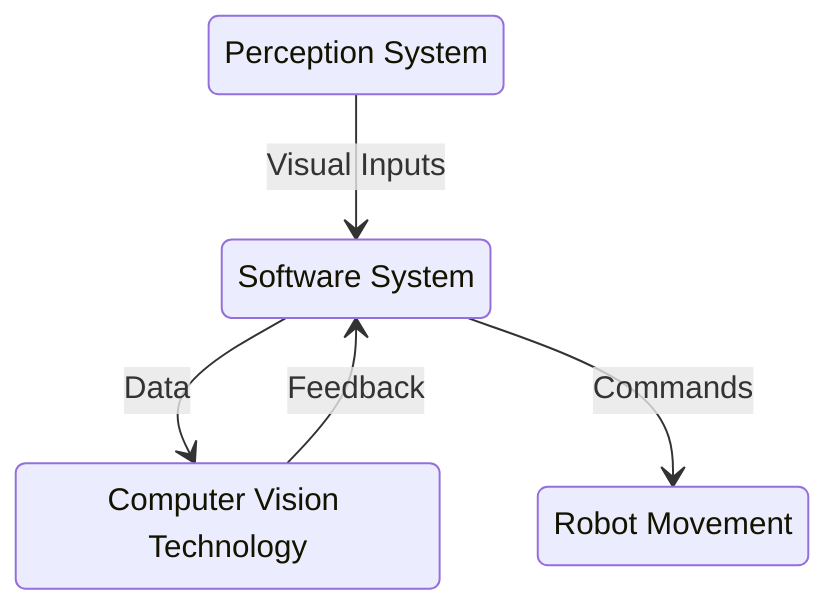

<link rel="stylesheet" href="../styles/styles.css" type="text/css">

<!-- TOC ignore:true -->
# Robot Vision System For A Pick And Place Task
<!--
	Co-Author: @dau501
	Editor(s):
	Year: 2023
-->

`System Requirements Specification`

<!-- TOC ignore:true -->
## Industry Project 24
List of your Names:

|Name|Position|Email|
|:-|:-|:-|
|@Slothman1|Team Leader/Client Liaison|id@swin.student.edu.au|
|@dau501|Development Manager/Planning Manager|id@swin.student.edu.au|
|@finnmcgearey|Support Manager/Developer|id@swin.student.edu.au|
|@vkach|Quality Manager/Developer|id@swin.student.edu.au|
|@NickMcK14|Support Manager/Developer|id@swin.student.edu.au|
|@Huy-GV|Quality Manager/Developer|id@swin.student.edu.au|

<!-- SUBJECT CODE, NAME, SEMESTER AND DATE -->

```gherkin
@Note:
Please read carefully.
Throughout this document, all text in RED ITALICS should be replaced with data relevant to your project.
Delete all the explanatory text in RED, including this box before submission.
```

<div class="page"/><!-- page break -->

# DOCUMENT SIGN OFF
|Name|Position|Signature|Date|
|:-|:-|:-|:-|
|@Slothman1|Team Leader/Client Liaison|student_signature(&emsp;)|DD/MM/2023|
|@dau501|Development Manager/Planning Manager|student_signature(&emsp;)|DD/MM/2023|
|@finnmcgearey|Support Manager/Developer|student_signature(&emsp;)|DD/MM/2023|
|@vkach|Quality Manager/Developer|student_signature(&emsp;)|DD/MM/2023|
|@NickMcK14|Support Manager/Developer|student_signature(&emsp;)|DD/MM/2023|
|@Huy-GV|Quality Manager/Developer|student_signature(&emsp;)|DD/MM/2023|

> *[When document is finalised for submission, all team members must affix their signature in the Document Sign Off table]*\
> ***[No-one should sign unless they have read the report and agree with it.]***

# CLIENT SIGN OFF
|Name|Position|Signature|Date|
|:-|:-|:-|:-|
|@FelipMarti|Research Fellow|<br/>|&emsp;/&emsp;/2023|

|Organisation|
|:-|
|Swinburne's Factory of the Future<br/><br/><br/><br/>|

> *[Client to sign off on the Project Plan to signify they agree with the plan]*

<div class="page"/><!-- page break -->

# Introduction
> *[Discuss briefly the software/system that will be developed.*\
> *Keep in mind that this document describes what the software must do, so that programmers can ultimately build it.]*

## Purpose
> *[Define the purpose of this SRS and identify its target reader or audience]*

## Scope
> *[Define the boundaries of the project.*\
> *Specify what the project will and will not accomplish.*\
> *Provide a name for the software/system and then list what the software/system will and will not do.*\
> *Describe the applications/uses of the software/system, including its benefit and objectives.]*
>
> ***[Do not list the software/system requirements here, as this should be a high-level summary]***

## Definitions, Acronyms and Abbreviations
> *[Provide the definition of all terms, acronyms, and abbreviations used in the RS.]*

<div class="page"/><!-- page break -->

# Overall Description
Project 24 is a new and complete system that aims to provide a robot with a vision or sensing system to perform pick and place tasks.
Currently, the robot at the FOF is performing pick and place tasks without any sensing or vision-guided system.\
If the object to pick and place is not in the predefined position, the robot cannot perform the task.\
This project will enable the robot to perform these tasks by providing it with a vision or sensing system.

The project requires specialization in Computer Vision, Sensors, Robotics, and AI and software programming skills in C/C++, Python, OpenCV, PyTorch, and ROS2.
It will require research into state-of-the-art technologies to provide the robot with a vision system to pick and place objects.
The project is managed using Kanban + GitHub for implementation and source control.\
The project will also follow SemVer for version control, and the documentation will be in Markdown format.

Project 24 is a component of a larger system that involves the integration of Computer Vision, Sensors, Robotics, and AI technologies.
The vision or sensing system will enable the robot to detect and analyze objects in real-time, and
the ROS2 will allow for easy integration of the various system components.



## Product Features
> *[Summarise the significant features of the software at high-level.]*

## System Requirements
> *[Discuss the minimum software and hardware requirements needed to **deploy** the software.*\
> *Be careful not to state requirements beyond what is required.*\
> *Also note that development and production requirements may be different.]*

## Acceptance Criteria
> *[List and discuss the major acceptance criteria for the system to be developed, at a high level.]*

## Documentation
> *[List all the documents that will be delivered along with the software.*\
> *This may include user manuals, tutorials and technical manuals.]*

<div class="page"/><!-- page break -->

# Functional Requirements
> *[Discuss what the system to be developed is to do, in detail.*\
> *Ideally, follow an established approach, such as use case analysis or task and support.]*

# Non-Functional (Quality) Requirements
> *[Discuss the non-functional (quality) requirements for the system to be developed.*\
> *Note that the quality requirements need to be verifiable, ie, can be shown having been achieved in the testing stage.]*

<div class="page"/><!-- page break -->

# Interface Requirements
> *[Describe how the software communicates with other entities when it is executing.*\
> *These may include any sub-sections below.*\
> *If any sub-sections below do not apply, the sub-section should state "The software has no &lt;sub-section heading> interface requirements".]*

## System in Context
> *[Describe how the system to be developed is related to the users and other systems/platforms.*\
> *A high-level diagram with accompanying descriptions is usually a good way to present this.]*

## User Interfaces
> *[Describe how the user will interact with the software/system.*\
> *This may be sample GUI or a console user screen.]*

## Hardware Interfaces
> *[Discuss the hardware that the software will interface to.*\
> *Describe how the software communicates, and/or controls the hardware.*\
> *This may include the communication protocol used and interface requirement such as communication port.]*

## Software Interfaces
> *[Discuss the other software applications that the software will interface to.*\
> *Other software applications may be database systems, and web servers.*\
> *Complete information of the other software applications must be provided, such as name, version and source.*\
> *Describe how the software interacts and/or communications with these other software.]*

## Communication Interfaces
> *[Discuss the communication interfaces that the software uses.*\
> *These may be local area network communication, internet communication via HTTP/HTTPS or FTP/SFTP.*\
> *If the communication is through another software application do not include it here.]*

<div class="page"/><!-- page break -->

# References (if any)
> *[If you have used information from published sources, show where it came from here (and cite them in the relevant places of this report).*\
> *Use the Harvard system of citation (or another system, but be consistent).*\
> *For instance, they may be books, journal articles, or websites.]*

> ***[Your reference list entry must be in the form of***\
> &emsp; **Author, Initial(s) Year, *Title of Document/Webpage/Website*, Organisation/Host, viewed Day Month Year, &lt;URL>.**
>
> &emsp; example
>
> &emsp; Yates, J 2009, Tax expenditures and housing, Australian Housing and Urban Research Institute, viewed 12 November 2013,\
> &emsp; <http://www.ahuri.edu.au/publications/download/ahuri_judith_yates_research_paper>.]
>
> ***[Your in-text may be in the form of***
> * **Direct quote**\
> "Most official estimates ..." (Yates 2009).
> * **Paraphrase**\
> Yates (2009) looked at the equity implications of tax ...]
>
> ***[For more information on the Harvard style guide, refer to***\
> &emsp; <http://www.swinburne.edu.au/lib/studyhelp/harvard_style.html>]
